# <font face="微软雅黑"  size="20">設計模式</font>

# 設計基礎

## 物件導向認知

>詳細見 [物件導向武功秘笈（1）：認知篇 — 什麼是好的程式](https://www.ycc.idv.tw/introduction-object-oriented-programming_1.html) 

- ### 好的程式需要 **「正常執行」**、**「穩健度」**、**「不重複撰寫」**、**「可讀性」**、**「可擴展」** 的特性
- ### 綜上所講就是 ，**高內聚** **低耦合**

- ### 程式寫完後要照步驟檢查
    0. 是否「可讀性」(連可讀都沒有怎寫程式)
    1. 是否「正常執行」
    2. 是否具有「不重複撰寫」特性
    3. 檢查一下「穩健度」和「可擴展」


## 物件導向三大特性：**封裝**、**繼承**、**多型**
>詳細見
>[物件導向武功秘笈（1）：認知篇 — 什麼是好的程式？](https://www.ycc.idv.tw/introduction-object-oriented-programming_1.html)   
>[物件導向武功秘笈（2）：招式篇 — Python與Java的物件導向編程介紹](https://www.ycc.idv.tw/introduction-object-oriented-programming_2.html#top) 
>[ 物件導向武功秘笈（3）：內功篇 — 物件導向指導原則SOLID](https://www.ycc.idv.tw/introduction-object-oriented-programming_3.html )   
> [程序员必备的七大面向对象设计原则（一）](https://blog.csdn.net/qiulongtianshi/article/details/7570021)            
>[程序员必备的七大面向对象设计原则（二）    ](https://blog.csdn.net/qiulongtianshi/article/details/7607192)               
>[程序员必备的七大面向对象设计原则（三）  ](https://blog.csdn.net/qiulongtianshi/article/details/7607351)         

      


### 1.封裝
- 就是將數據封起來，避免被其他類引用，有以下這些方法，
  但實際上有其他方法，EX：用Void來取得數據

- 而且封裝在物件導向有時不是指數據封裝，是指類別封裝，將類別關起來

> public：所有對象都可以訪問；
> 
> private：對象本身在對象內部可以訪問；
> 
> protected：只有該類對象及其子類對象可以訪問
> 
> internal：同一個程式集的對象可以訪問；
> 
> protected internal：訪問限於當前程式集或派生自包含類的類型。
> 
> get {return _firstName;}set {_firstName = value;} <=利用屬性取得封裝數據


### 2.1 抽象 (被歸類在繼承裡面)

- 就是C＃將類給抽象化就是這只是類的模版，無法實例化

- 抽象與虛擬差異在於，抽象需要override 重寫，虛擬方法可以先寫好，要不要override 隨意

> 詳見 [(C#) 區分 abstract、virtual、override 和 new](http://jimmy0222.pixnet.net/blog/post/37271702)

> abstract => 抽象方法。
> 
> virtual => 虛擬方法。
> 
> override => 覆蓋基礎類別方法。
>
> new => 隱藏基礎類別方法。
> 
> override 和 new 有時都叫覆寫基礎類別方法。
> 


### 2.2 繼承
- 指的是子類繼承父類，而子類有父類所有非私有的數據，就是把父類的程式碼塞到子類裡
- C＃ 只能單一繼承

```csharp
public class A //父類
{
Protected int value = 10;
}

public class B : A//子類
{
public int GetValue(){return this.value;}
}

ClassB繼承後實際上程式碼變成這樣
public class B //子類
{
protected int value = 10;//這是父類的
public int GetValue(){return this.value;}//這是子類的
}
```

### 3.多態

- 就是一個類可以有很多種型態
    - EX:當子類繼承父類，宣告父類陣列時，子類也能放進去，因為子類有父類的型態
    - EX2:當類繼承介面Interface 宣告Interface 陣列時該類也能放進去，因為該類有Interface 型態

- 還有就是Void（函示）多態，只要後面接的變數不一樣，函示名字可以一樣
```
EX: 
Test()
Test(int a)
Test(int a,string b)
```

## UML 類圖
>詳見
>[ 物件導向武功秘笈（3）：內功篇 — 物件導向指導原則SOLID](https://www.ycc.idv.tw/introduction-object-oriented-programming_3.html )   
> [ 類別圖「關聯」、「聚合」及「組合」比較](https://dotblogs.com.tw/lazycodestyle/2016/06/01/233545)

### 類圖

- 類別(Class): -代表private，+代表public，#代表protected

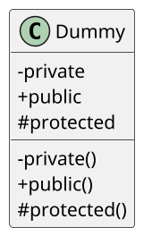

- 抽象類別(Abstract Class)，則類名字是斜體

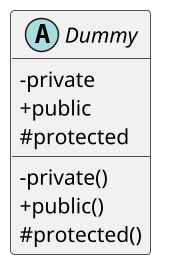

- 接口(Interface)，UML類圖上會標上Interface，並要I開頭的變數名

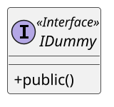

- 列舉 (enum) : UML規範沒強制，PlantUML是一個E字

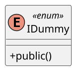


### 類別關係

#### 關係
>詳見
> [ 類別圖「關聯」、「聚合」及「組合」比較](https://dotblogs.com.tw/lazycodestyle/2016/06/01/233545)

- 關聯(Association)
「關聯」其實是蠻常見的一種關係，指A類別會參考到B類別的資訊，但此兩類別是彼此獨立的，沒有一種擁有 (has-a) 的關係。例如「冷空氣」與「天氣」

- 聚合(Aggreation)
「聚合」是具有 has-a 特性的一種「關聯」，但兩類別彼此還是獨立的，不會因為一個消失而另外也會消失。例如「課程」與「學生」的關係

    - 「課程」與「學生」的關係可以整理成下面兩點「聚合」的特性
        - 一門「課程」可以有0到n位「學生」修 → has-a 關係
        - 當一門「課程」無法順利開成時，沒有「學生」會消失 → 彼此獨立

- 組合（Composition）
「組合」是「聚合」更進一步的關係，除了擁有 has-a 關係之外，他們還是互相相依的，一個類別物件不見的時候，另一個也會消失不見。像「飛機」與「引擎」此兩類別。
    - 一架「飛機」可以擁有多顆「引擎」，當該架「飛機」背摧毀的時候，機上的「引擎」也會背摧毀。
    - 當一架「飛機」被製造出來的時候，機上「引擎」們也會一起被製造出來。

#### 以下UML類圖

- 繼承關係(Inheritance)和抽象類、接口實現  
    - 繼承是空白三角形線
        - Class繼承是實線
        - 抽象類、接口繼承則是虛線

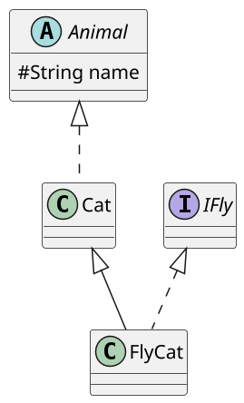

- 關聯關係(Association)：A類中使用B類當作「成員變數」，但是A和B並**沒有「擁有」的關係**，只能說是「有個」的關係，就稱為：A關聯到B，英文為"has-a"的關係。
    - 關聯關係 實心箭頭只向某個類

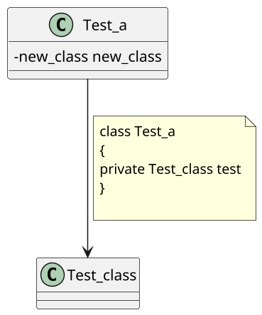

- 聚合關係(Aggregation)：A類中使用B類當作「成員變數」，而且A和B有一個**弱的「擁有」關係**，A包含B，但B不是A的一部分，拔掉B，A依然能存在，就稱為：A聚合到B，英文為"owns-a"關係。
    - 空心菱形箭頭指向某個類

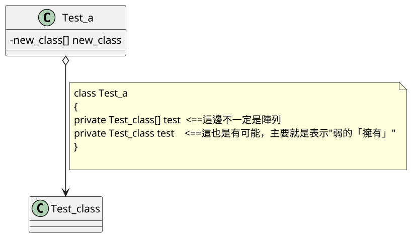

- 合成（組合）關係(Composition)：A類中使用B類當作「成員變數」，而且A和B有一個**強的「擁有」關係**，B是A的組成的一部分，拔掉B，A就不完整，就稱為：A合成到B，英文為"is-part-of"關係。
    - 用實心菱形箭頭指向類
    
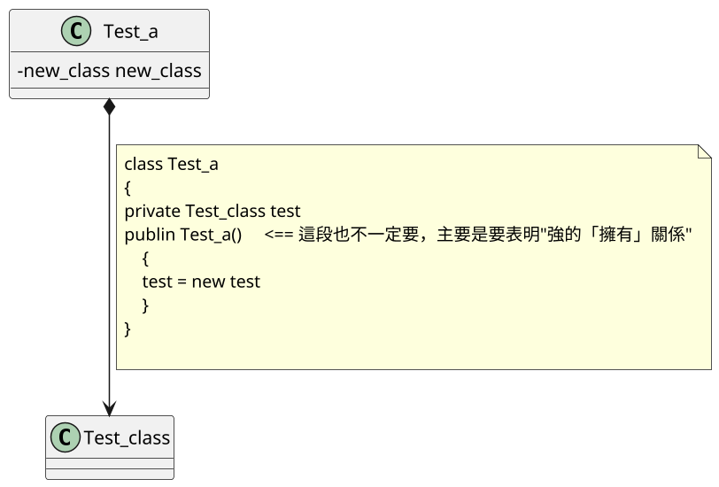

- 依賴關係(Dependency)：A類中使用到B類，但僅僅是弱連結，譬如：B類作為A類方法的參數、B類作為A類的局域變數、A類調用B類的靜態方法、B類作為A類方法的回傳值，就稱為：A依賴B，英文為"uses-a"的關係。
    - 用虛線箭頭表示
    
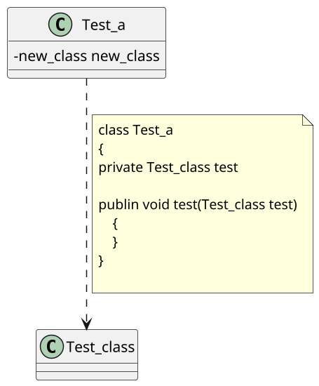

----------

# 設計模式原則

## 單一職責原則 (陸譯:单一职责原则)

### 定義
-  一個對象只包含一個職責，並被封裝成一個類
-   一個類，應該只有一個改變的原因

### 白話文
就是一個類，只做一件事，
分擔責任，避免一個類責任太多，

### UML

這是不好的，因為全部都集中在一個類中
後期維護會很麻煩
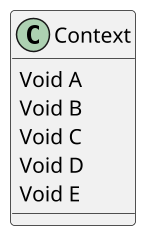

改成這樣，讓State繼承
Context就可以使用ConcreteStateX系列的函式
到時有新的功能，也知需要新增一個類就好

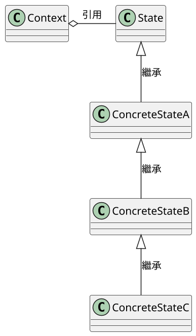

<b>
<font face="微软雅黑" color="red" size="10">
單一職責原則總結：<br>
就一個類而言，應該僅有一個引起它變化的原因。
</font>
</b>


## 2.開源封閉原則(陸譯:开闭原则)

### 定義
- 程式碼要對擴充開放，對修改關閉

### 白話文
不要隨隨便便改程式碼，越改錯越多
記得要留點彈性，免得突然要增加新功能

### UML

一個客戶端，只接運算類，加法減法之類通通放在一起，
哪天改就要打開來修正，怕會改錯東西

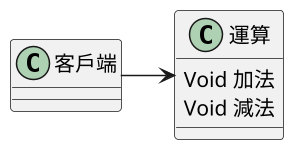

改成這樣客戶端只要使用運算類，
就可以動用加法減法，並且新增算法只要新增類

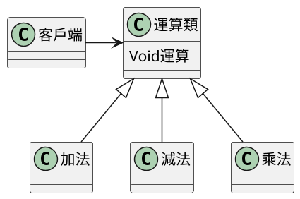

<b>
<font face="微软雅黑" color="red" size="10">
開閉原則總結：<br>
面對需求，對程式的改動是通過增加新代碼進行的，而不是改變原來的代碼
</font>
</b>

## 3.里氏替代原則(陸譯:里氏代换原则)

>詳細見
>[ 物件導向武功秘笈（3）：內功篇 — 物件導向指導原則SOLID](https://www.ycc.idv.tw/introduction-object-oriented-programming_3.html )   

### 定義
- 衍生類別（子類）物件可以在程式中代替其基礎類別（超類）物件。

### 白話文
繼承後的子類，除非必要，不要改父類的東西，
子類就是父類的延伸
下圖為示意圖 詳細見[ 物件導向武功秘笈（3）：內功篇 — 物件導向指導原則SOLID](https://www.ycc.idv.tw/introduction-object-oriented-programming_3.html )   


### UML

以"正方形"和"長方形" 舉例
以繼承的"Is-a"來看
正方形 Is-a 長方形 ==>對(UML左)

但里氏替代原則就覺得不對
因為"正方形"只需要"width"變數
但是"長方形"需要"height"" width"兩變數
所以"正方形"繼承"長方形"，就會多出"height"變數，容易出錯
所以應該改用"關聯"替代"繼承"(UML右)

PS:
講簡單就是一個是只有一個變數，一個兩個變數，繼承一定會出問題

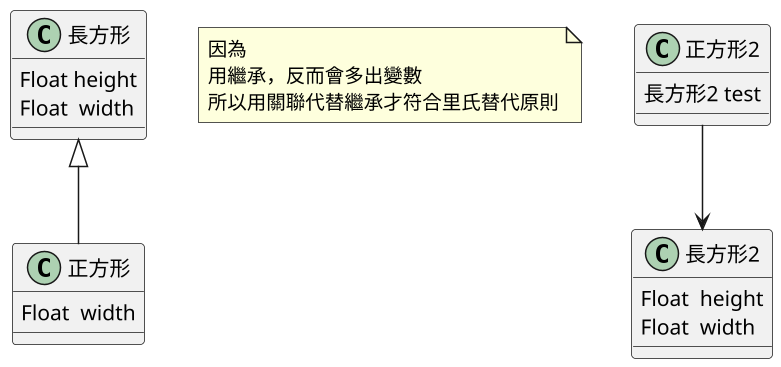

<b>
<font face="微软雅黑" color="red" size="10">
裏氏替換原則總結：<br>
子類型必須能夠替換掉它們的父類型。
</font>
</b>


## 4.相依性反向原則(陸譯:依赖倒转原则、依賴反轉原則)

>詳細見
>[ 物件導向武功秘笈（3）：內功篇 — 物件導向指導原則SOLID](https://www.ycc.idv.tw/introduction-object-oriented-programming_3.html )   
> [ 程序员必备的七大面向对象设计原则（二） ](https://blog.csdn.net/qiulongtianshi/article/details/7607192)
> [SOLID 之 依賴反轉原則（Dependency inversion principle）](https://ithelp.ithome.com.tw/articles/10192844)
> [A Simple DIP Example](https://flylib.com/books/en/4.444.1.71/1/)
>[高層模組和底層模組 ](https://www.zhihu.com/question/58471765/answer/311356521)                   
>[浅谈控制反转与依赖注入](https://zhuanlan.zhihu.com/p/33492169)                                      

### 定義
- 高層次模組不應該依賴低層次模組，兩者都應該依賴抽象。而抽象不應該依賴細節，反之細節應該要依賴抽象。
- 針對接口編程，非針對實現編程

### 白話文
用例子說明
有個檯燈，檯燈上有按鈕，按下後控制檯燈發光
讓按鈕Class關聯檯燈Class
這樣按鈕過度耦合檯燈，違反相依性反向原則

所以改成
按鈕關聯按鈕Interface，讓檯燈繼承按鈕Interface

PS:
其實能想成Interface、abstract，就是所謂的藍圖
而Class就是做好的產品
Class跟Class之間不要耦合，就像車子跟車子不能組合再一起
但Interface、abstract就可以，因為在藍圖上車子可以拼再一起

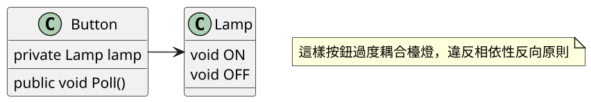
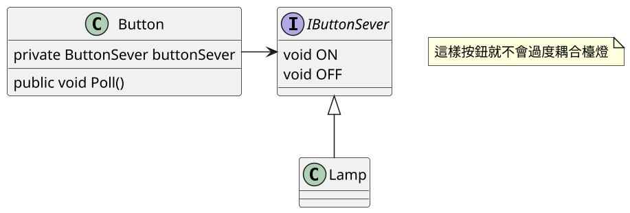

<b>
<font face="微软雅黑" color="red" size="10">
相依性反向原則總結：<br>
高層模塊不應該依賴底層模塊，兩個都應該依賴與抽象；抽像不應該依賴於細節，細節應該依賴於抽象。
</font>
</b>

## 5.介面分割原則(陸譯:接口隔离原则、介面隔離原則)

>詳見
>[SOLID 之 介面隔離原則（Interface segregation principle）
](https://ithelp.ithome.com.tw/articles/10192464)

### 定義
- 客戶類不應該被強迫依賴那些它不需要的接口，類別間的彼此依賴應該建立在盡可能小的接口上
- 這邊"接口"指的是"廣義接口"，可以是客戶端和業務邏輯的分離介面、物件的開放方法、抽象類別和Interface。
- 接口隔離，遵守到單一職責即可

### 白話文
用例子說明
有隻狗(Class)，會吃飯、會睡覺、會握手
主人(Client端)呼叫都能工作
今天新來一隻狗，會吃飯、會睡覺、但不會握手
他才剛到，不會握手，
那主人(Client端)呼叫新狗就沒法做事，
那要新狗在握手函式上丟個例外，又會違反里氏替代原則
所以需要將接口切割，分成天生(會吃飯、會睡覺)，後天(會握手)

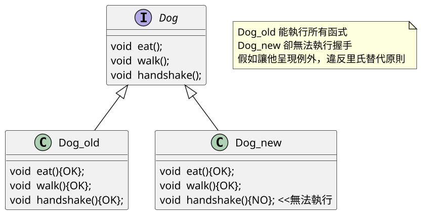

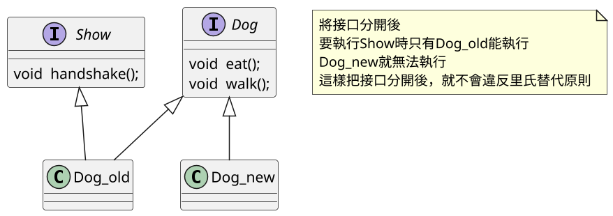

<b>
<font face="微软雅黑" color="red" size="10">
介面分割原則總結：<br>
類應該完全依賴相應的專門的接口
</font>
</b>

## 6.最少知識原則(陸譯:迪米特法則)

>詳見
>[不在 SOLID 裡的 最小知識原則（Least Knowledge Principle）](https://ithelp.ithome.com.tw/articles/10193110)
>[程序员必备的七大面向对象设计原则（三）](https://blog.csdn.net/qiulongtianshi/article/details/7607351)
>[物件導向武功秘笈（3）：內功篇 — 物件導向指導原則SOLID](https://www.ycc.idv.tw/introduction-object-oriented-programming_3.html)

### 定義
- 對於類別C的所有方法M而言，在M的方法中僅能訪問以下物件的方法
    - 類別C自身
    - M的輸入參數
    - C的成員變數
    - M的輸出物件
    - 全域變數的物件

### 白話文
- 一個類只能訪問，出現在自身類裡的變數或函數
- 減少對外公開的數據

### UML

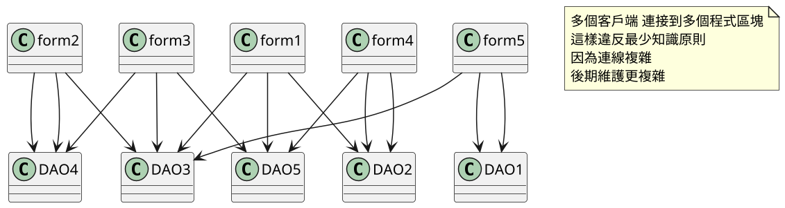

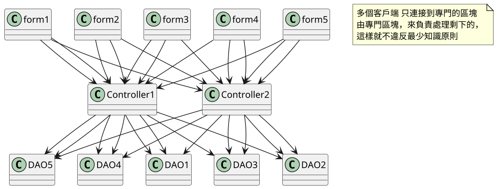

PS:
其實這例子舉的不太好，因為這樣ControllerX有點違反最少知識原則
但假如只考量客戶端那塊的話，確實沒違反
要更詳細解釋的話去這個網站看[不在 SOLID 裡的 最小知識原則（Least Knowledge Principle）](https://ithelp.ithome.com.tw/articles/10193110)

<b>
<font face="微软雅黑" color="red" size="10">
最少知識原則總結：<br>
一個軟件實體應當盡可能少的與其他實體發生相互作用
</font>
</b>


## 7.少用繼承多用組合(陸譯:合成复用原则)

>詳見
>[設計模式學習筆記 之「多用組合，少用繼承」 C 代碼](http://www.ifuun.com/a20171025712064/)

### 定義
- 盡量使用對象組合，而不是繼承來達到復用的目的。

### 白話文
可以透過interface、abstract，等方式
將容易改變的地方拆分出來，
這樣不用為了改變一點而去動到程式碼

### UML
舉個例子
有個父類叫Duck(鴨子)
本來好好的，今天突然要鴨子飛
若是改變Duck這父類，有些不會飛的鴨子就突然會飛了
所以要把"飛"這個容易改變的拆出來用interface來使用

```puml
@startuml
skinparam classAttributeIconSize 0
scale 1.5

class Duck
{
eat()
fly()
}

class NormalDuck
{
eat(OK)
fly(OK)
}

class NoFlyDuck
{
eat(OK)
fly(NO) <===這邊無法執行，違反里氏代換原則
}

Duck <|-- NormalDuck
Duck <|-- NoFlyDuck


note as N1
NoFlyDuck 無法執行 Fly()函式
這樣違反里氏代換原則

end note

@enduml
```

```puml
@startuml
skinparam classAttributeIconSize 0
scale 1.5

interface IFly
{  
fly()
}

class Duck
{
eat()
}

class NormalDuck
{
}

class NoFlyDuck
{
}

Duck <|-- NormalDuck
IFly <|-- NormalDuck
Duck <|-- NoFlyDuck


note as N1
將Fly函式拆成Interface
這樣不會違反里氏原則

乍看下跟介面分割原則很像
但少用繼承多用組合原則更注重在"組合"這上面
end note

@enduml
```


<b>
<font face="微软雅黑" color="red" size="10">
少用繼承多用組合總結：<br>
類中應用，盡量使用對象組合而不是用繼承來達到復用的目的。
</font>
</b>

<!--
# 設計原則總結

其實在原本在[物件導向設計模式－可再利用物件導向軟體之要素](https://www.tenlong.com.tw/products/9789572054116)中提到的
設計模式原則SOLID 只有5個分別是
1. 單一職責原則
2. 開閉原則
3. 里氏替換原則
4. 介面隔離原則
5. 相依性反向原則
"少用繼承多用組合"、"最少知識原則"是後面才提出的，但這兩原則在設計上也很重要
-->

