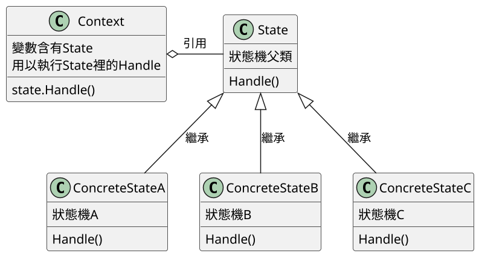
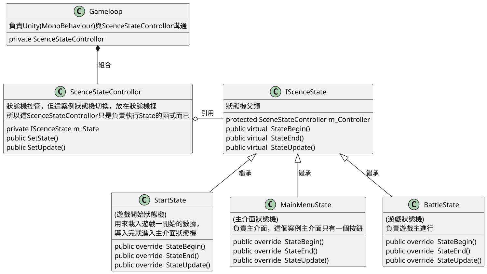
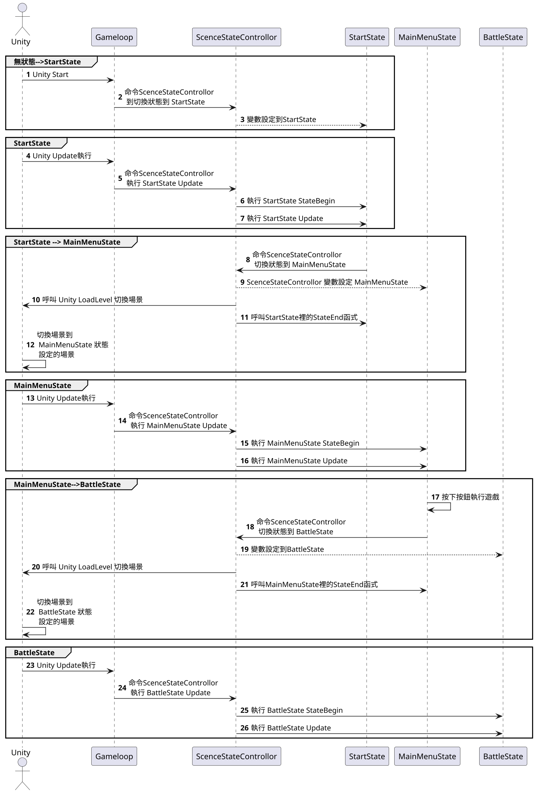

# 狀態模式 State

## 講解
- ### 狀態模式 就是製作每份狀態，透過狀態更換來，來進行解耦合，在遊戲中最典型的就是**狀態機AI**
- 優點 在於可以減少因為改變，而修改大量現有程式碼，因為現有的程式碼已經寫入該狀態機，新的狀態機只需新增並更改少量部分即可新增狀態
- *在書中介紹**狀態模式**是使用切換場景來當範例*

### 以下是基本類圖

Context是宣告State變數，
而ConcreteStateA_B_C繼承State
Context就能執行ConcreteStateA_B_C裡的Handle()函式

### 以下是書中類圖(Unity切換場景)

#### 1. IScenceState裡面有
- 變數
     - ScenceStateControllor 
- 函數
    - StateBegin() State剛開始要執行的，例:遊戲數據載入.....
    - StateEnd()    State要結束要執行的，例:釋放GC的
    - StateUpdate() State每禎要執行的，例:遊戲進程

#### 2. ScenceStateControllor 裡面
- 函式
    -  SetState     在這個例子就是轉場，但實際上是設定狀態
    -  SetUpdate 執行狀態裡的Update

#### 3. Gameloop
- 變數
    - ScenceStateControllor 這個變數是放在Untiy Update裡，讓ScenceStateControllor執行每禎Update也就是StateUpdate

#### 總結下

1. Gameloop是讓Unity與State分離開來，透過ScenceStateControllor變數讓State可以使用Update

2. ScenceStateControllor裡面則是負責對接State，讓State能使用Update

3. IScenceState 裡面最重要的是SceneStateController變數這段，能讓State自己決定轉換State，  
例:StartState==>MainMenuState  ，StartState執行完後自己跳到MainMenuState

####  案例中時序圖

