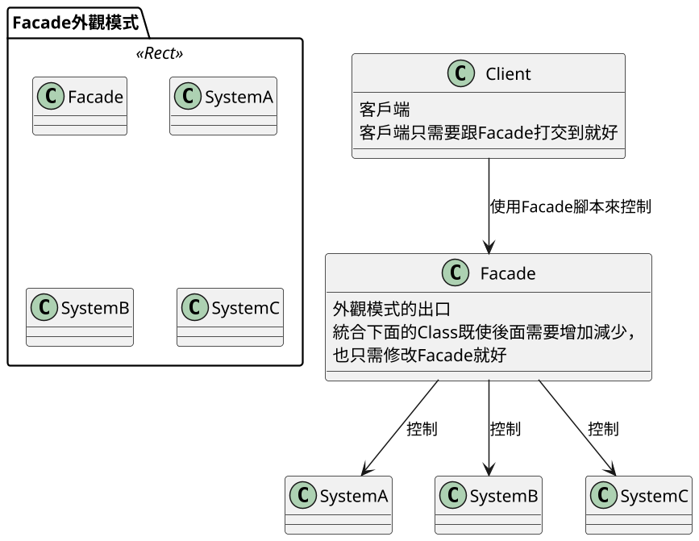
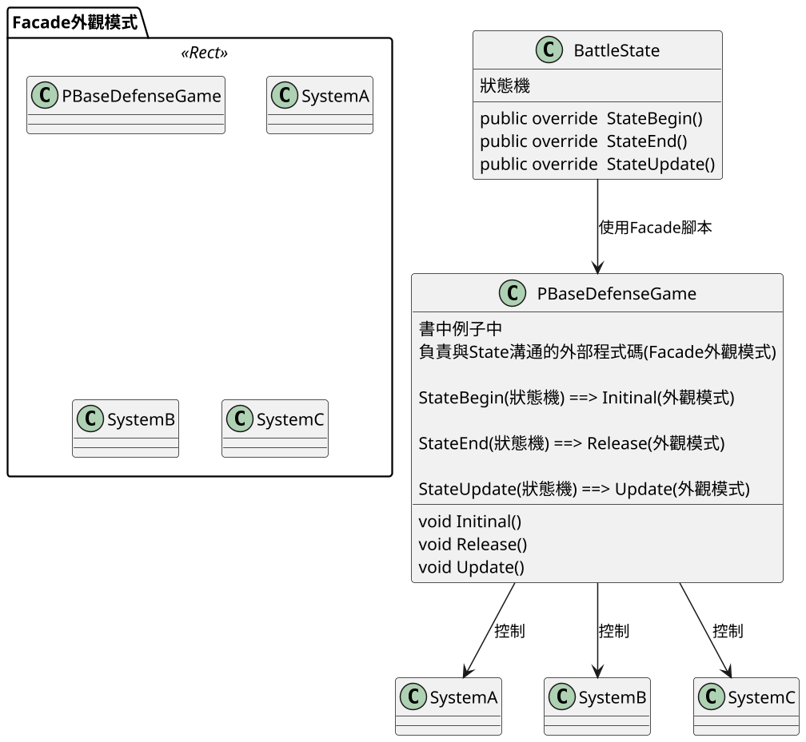
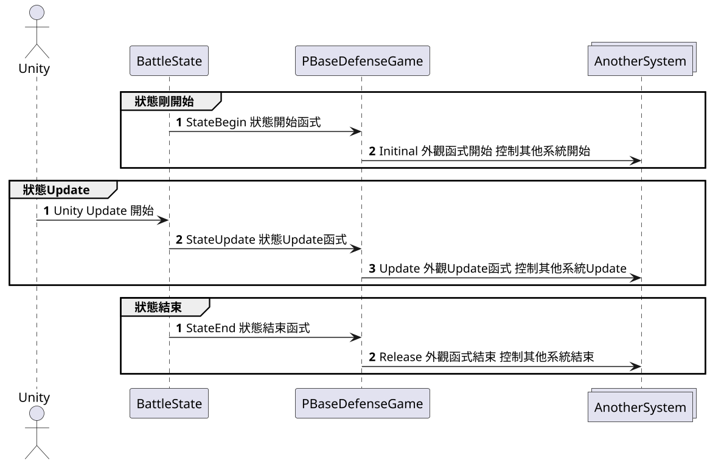

# 外觀模式 Facade

## 講解
- ### 外觀模式 就是給一堆Class一個共通的出口，以避免Client與過多跟他無關的Class耦合
- 優點 就是無需讓Client打交道，只需要一個Class(Facade)做出口就可以，既使後面有其他腳本，也只需修改Facade就可以，而且將東西縮減，這樣後續維護也方便
- 在書中外觀模式是將遊戲中其他系統例:"兵營系統""士兵系統"....  
跟狀態機BattleState連接來解耦

### 基本類圖

### 以下是書中類圖(BattleState狀態機控管System)

#### BattleState裡面有
- 函數
    - StateBegin() State剛開始要執行的，例:遊戲數據載入.....
    - StateEnd()    State要結束要執行的，例:釋放GC的
    - StateUpdate() State每禎要執行的，例:遊戲進程

#### PBaseDefenseGame 裡面
- 函式
    - void Initinal() 對應到StateBegin
    - void Release() 對應到StateEnd
    - void Update() 對應到StateUpdate
- 實際上就是將BattleState裡的函式對應到外觀模式(PBaseDefenseGame)上的三個函式

#### 案例中時序圖

