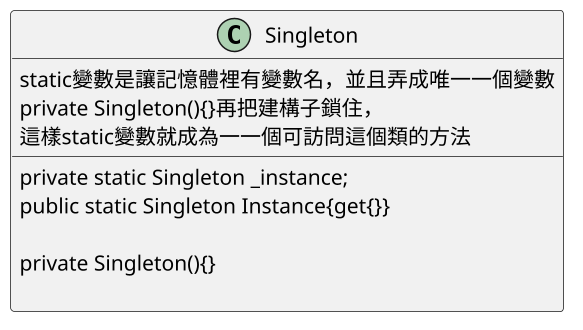
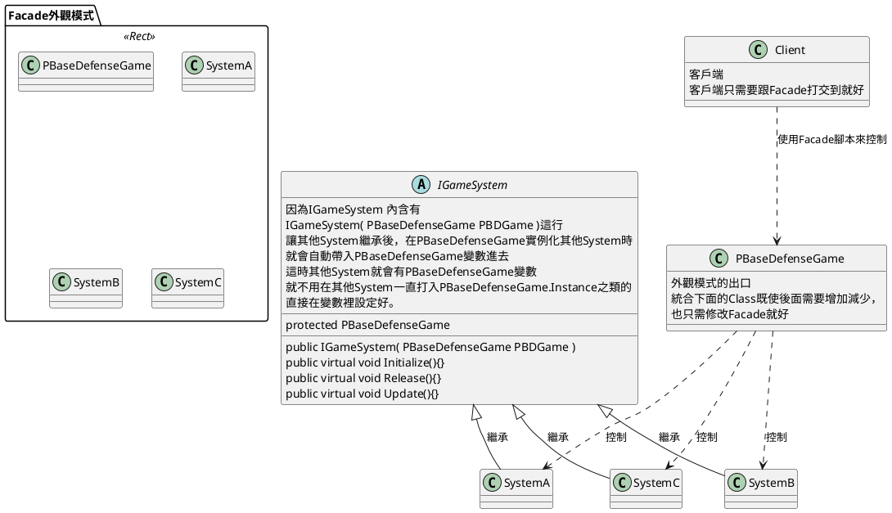
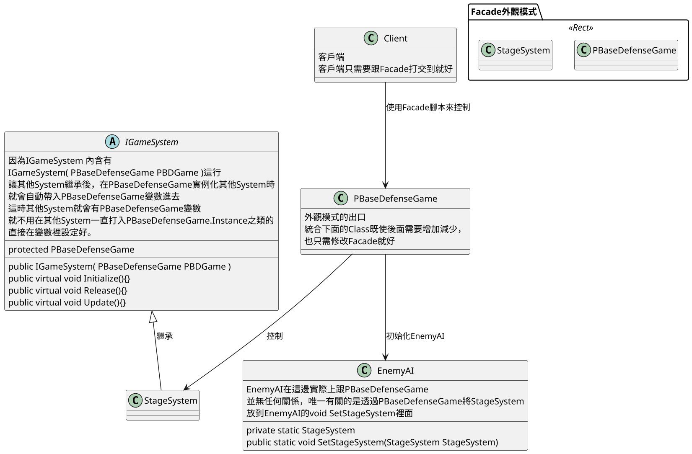
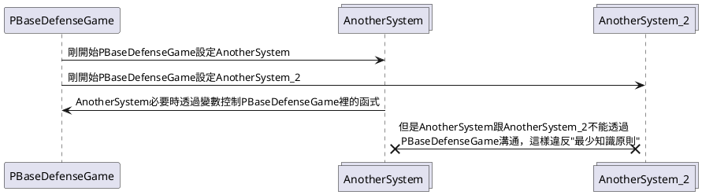
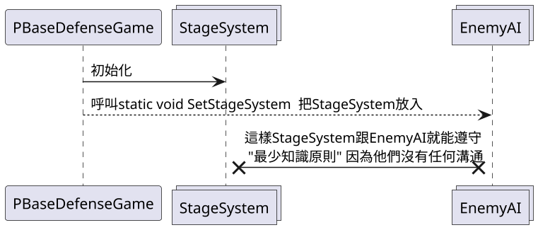

# 單例模式 Singleton

## 講解
- ### 單例模式 就是讓某個類，對外公開且某類只會存在一個實例
    - 優點 不會那麼麻煩，為各個類搞那麼多事情
    - 缺點 容易搞得整個專案都是單例模式

- ####  要區分是使用 "類的單例模式" 還是使用 "Static的函式(例:SetAI)"

- ### 單例模式 分類
    1. 懶漢式 :要用時才實例化
    2. 餓漢式 :一開始就實例化
    3. 登記式(可忽略): 就是多個列表，把Class存起來

- # 以上只是普通單例模式

## 書中單例有例外一種表達方法

<!--
### 第一種 (這是中介者模式，只是在中介者上多套上單例) 
書中單例模式的Class有兼具外觀模式，
所以System都繼承一個abstract Class
而這Class裡面的建構子，強制綁定單例模式Class的變數
這樣的話就不用在每個System裡打入PBaseDefenseGame.Instance之類的
並且其他的System也能透過單例模式Class的變數來運用
以下是書中的UML

-->

<!--
### 第二種
第二種叫做Static函式
-->

### Static函式
叫做Static函式
在書中有個叫"EnemyAI"的Class需要個"StageSystem"的Class
所以"EnemyAI"裡面多個

> private static StageSystem	m_StageSystem = null;
> public static void SetStageSystem(StageSystem StageSystem)

這樣的不必將"EnemyAI"單例模式化而是指讓"變數static化"
這樣不用冒未來維護的麻煩

而且EnemyAI在書中是怪物生成就要加入倒怪物變數裡
在書中StageSystem是不會變動的所以才一開始導入
而EnemyAI不是單例模式，所以可以更動變數裡的數據，
就不會像是單例模式那樣綁手綁腳

### 案例中時序圖
<!--
#### 第一種
程式執行時優先順序，以及注意事項

#### 第二種
-->
程式執行時順序

