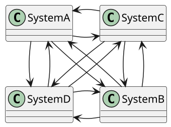
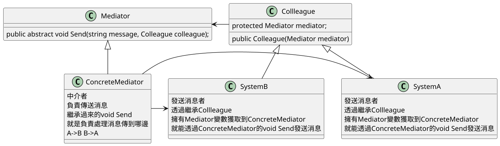
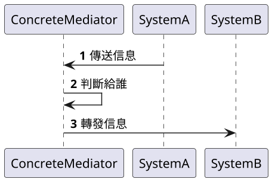
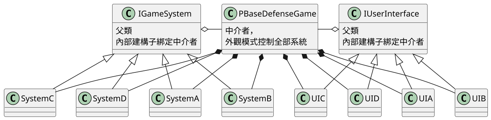
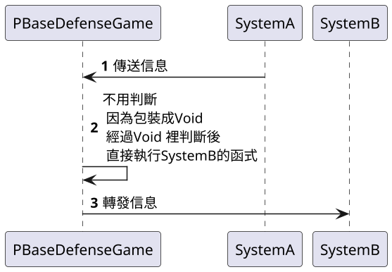

# 仲介者模式 Mediator

## 講解

- ### 仲介者模式 就是讓某個類成為中間類，所有類跟類的訪問都通過他
- 優點 減少類跟類的耦合，因為都可以透過中介者來通知，新增的話只需更改中介者就行

### UML圖

#### 無中介者UML

各Class之間過度耦合，違反"最少知識原則"
後期維護複雜

#### 中介者模式UML

全部只要透過ConcreteMediator轉發消息就可以
後期新增只要
修改ConcreteMediator
新增System

#### 中介者模式時序圖

## 書中案例

書中是把 中介者Class使用單例模式 變成
PBaseDefenseGame同時有"外觀模式"，"單例模式"，"中介者模式"
在這邊"單例模式"讓各個類能訪問
"中介者模式"控制UI和System兩大系統
"外觀模式"就是方便Client控制

#### UML圖

#### 時序圖

