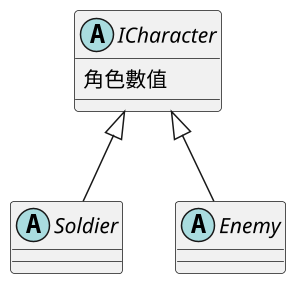

# 進入第六章以前須知

第六章以後是有關角色設定部分，在書中案例是
1. 角色數值
2. 裝備武器
3. AI
這些是分開的，並且還分成兩大陣營

在書中是設定一個叫ICharacter的父類，並給Soldier、Enemy繼承
後續系統在該模式講解

```puml
@startuml
skinparam classAttributeIconSize 0
scale 1.5


abstract class ICharacter{
角色數值
}

abstract class Soldier{

}
abstract class Enemy{
}

ICharacter <|-- Soldier
ICharacter <|-- Enemy

@enduml
```