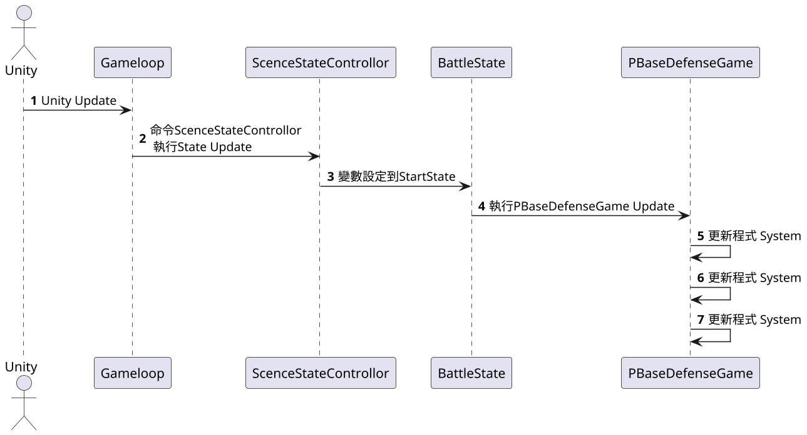

# Unity遊戲迴圈解偶

在執行遊戲時Update十分重要，對於程式代碼更新也是，
**將需要更新的程式功能與Unity 3D 解偶**
在書中是把Update(程式的並非Unity的)放在PBaseDefenseGame下面
每當Unity Update執行時PBaseDefenseGame也會執行，用來更新程式
這樣做就不會一堆程式，卡著Unity Update，或是更新順序錯了
**更重要的是將遊戲邏輯更新跟Unity分割，就不必被Unity所限制**

