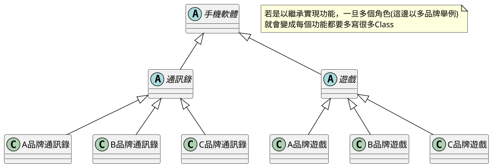
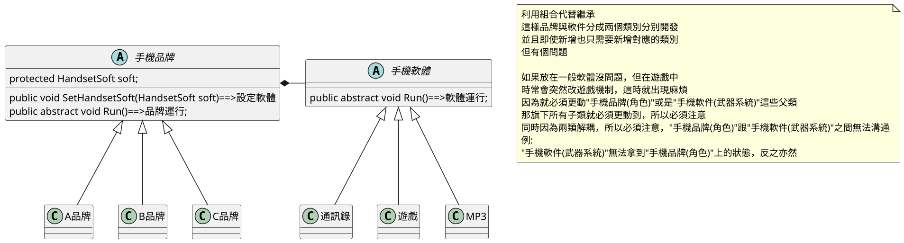
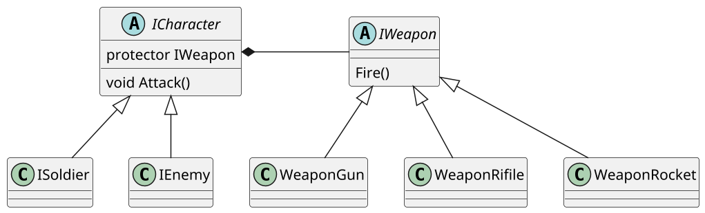

# 06.橋接模式 Bridge

## 講解

### 橋接模式

橋接模式，是讓兩個"介面"接再一起，實現已組合代替繼承的作法
例子:手機品牌與手機軟體
這兩個是分開的項目，若是用繼承方式，會變成過多的類別，所以用組合方式實現

### 書中案例

在書中橋接模式是用在角色跟武器系統上，將兩個系統分開來
創建角色時就能為角色換上不同武器

### 總結下

透過橋接模式，能將角色和武器數據分割
武器所要執行的"粒子"，"判定"，"模型"
都可以和角色數據分開，不用為了新增角色，而增加許多繼承類
這樣透過**組合**方式代替**繼承**