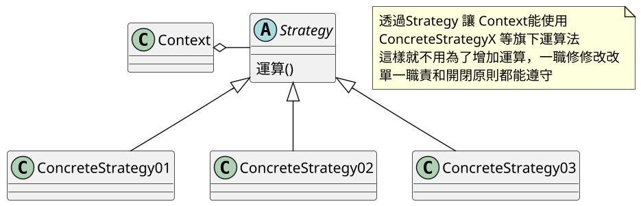
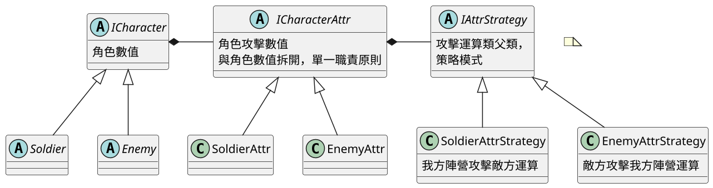
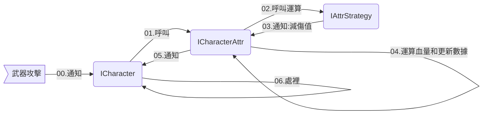
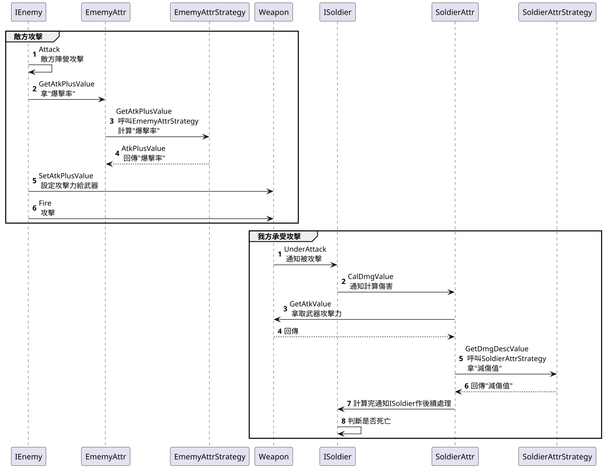

# 07.策略模式 Strategy

## 講解

### 策略模式是將運算類統一一個父類，由子類繼承後改寫運算式，每個運算式獨立且可以復用
- 優點 : 要修改運算類裡的運算，只要透過新增等方式就可以搞定 (尤其是企劃要修修改改時)
- 注意事項 : 與State狀態模式差異，策略模式UML圖跟狀態模式很像
    - 狀態更注重切換規則這邊，也就是每個狀態代表的事情
    - 策略模式，各個類之間沒有關係，也就類跟類之間沒有關聯



## 書中範例

### 書中範例是負責計算角色的數值

#### 數據有
- 我方 : "等級"、"生命力"、"攻擊力"
- 敵方 : "生命力"、"攻擊力"、"爆擊率"

#### 流程的話是
1. A單位 決定攻擊 B單位
2. 單位A "爆擊率" 數據添加到 "武器"
3. A單位 用武器攻擊 B單位
4. 單位B 受到攻擊後 取的"單位A武器攻擊力"
5. 取的 單位B "生命力"
6. 單位B "生命力" 減去 "單位A武器攻擊力" 並考量 "單位B等級抵銷攻擊力"
7. 單位B 生命力小於0 陣亡

##### 上述流程
- 第2步 只有敵方有
- 第6步 只有玩家有
- 初始化時，"生命力" 跟 "等級" 掛勾

<!--
##### 流程圖


```flowchart
st0=>start: AI開始
st=>start: A單位
op1=>operation: 準備攻擊
op2=>subroutine: 計算"爆擊率(敵方專用)"和"攻擊力"
op3=>operation: 設定給武器
op4=>inputoutput: 攻擊
st2=>start: B單位
op5=>operation: 取的單位A武器攻擊力
op6=>operation: 取的單位B生命力
op7=>subroutine: 計算"生命力"、"攻擊力"、"等級"
cond1=>condition: 是否死亡
e=>end: 死亡


st0->st->op1->op2->op3->op4(right)->st2->op5->op6->op7(right)->cond1
cond1(yes)->e
cond1(no)->st

```
-->

### 為何講那麼多，因為關於這部分，流程是最重要得，接下來開始講跟程式有關的

#### 先看UML



#### UML講解

首先最重要的是這三個

##### ICharacter 負責角色 ，角色的音效，死亡，判斷都歸他

##### ICharacterAttr只負責 **"攻擊數據"** 也就是 "等級"、"生命力"、"攻擊力"、"爆擊率"這些，完全不會碰觸到跟判斷有關的事情  

##### IAttrStrategy只負責 **"計算"** 也就ICharacterAttr只負責**數據計算**，完全不會碰觸到跟判斷有關的事情

PS:
這邊ICharacterAttr其實負責"減血量"，IAttrStrategy負責計算"減傷值"   
也就是ICharacterAttr裡面是 "血量 -(武器-減傷)"的數值運算
而IAttrStrategy負責"減傷"運算
所以並非IAttrStrategy負責全部運算
其實是因為將責任分割掉ICharacterAttr統管數據 IAttrStrategy負責其他數據
不分割的情況，違反單一原則，因為運算類會牽扯到角色數據

##### 簡易流程圖



## 總結下

在書中策略模式是負責管理運算數據，雖然只有"減傷值"一個，但是在實際情況可能會有更多運算或是企劃要改運算
策略模式也能應用在登錄上，  
只要設定一下，Google登陸(ConcreteStrategy01) 帳號登陸(ConcreteStrategy02) FB登陸(ConcreteStrategy03)
這樣就能為多登陸方式進行設定，要拿掉也只要取消掉Script腳本就可以

書中更改運算方式很簡單
1. 新增繼承IAttrStrategy的Class
2. 改下運算式
3. 讓ICharacterAttr使用

### 時序圖



