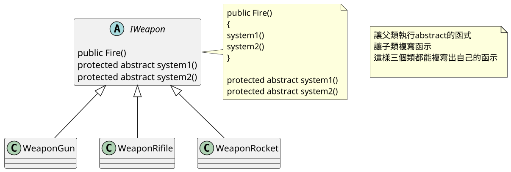

# 08.樣板模式 Template Method(陸譯:模板模式)

## 講解
- 樣板模式，就是將要執行的函式abstract化，讓子類複寫
- 用比喻的化就是，考卷是父類，答案是abstract化函式 ，由子類複寫

## 書中案例

書中案例是武器有多款，每把武器音效、動畫，都不一樣
所以在Fire函示裡，把音效動畫改用abstract的話，繼承給不同武器，複寫後就能設定不同音效動畫

## 結論

樣板模式實際上很簡單，就是設定函示，讓子類複寫
這樣板模式很適合在這邊，武器之類，步驟都一樣情況下
可以讓子類複寫讓每個類表現不一樣，
尤其是怕企劃改東西，沒做樣板模式的話，就要一次改多個類

