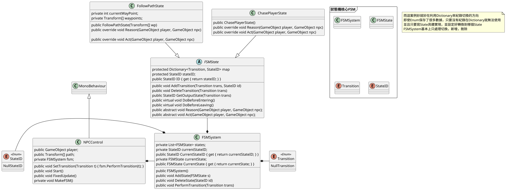
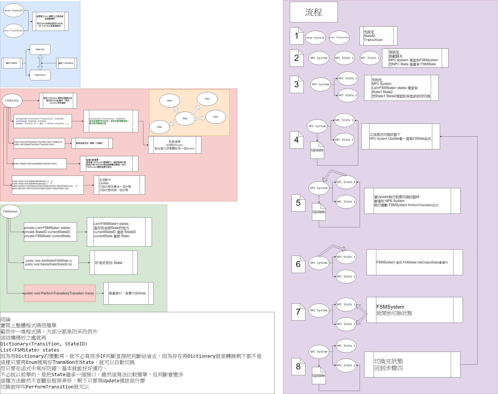

# 09.2題外話 Unity Wiki 上的狀態機

[讓你輕鬆學會unity的狀態機?
](https://www.twblogs.net/a/5b8cfa142b7177188338198e)

[Unity WIKI](http://wiki.unity3d.com/index.php/Finite_State_Machine)

## 官方原文

### Description
This is a Deterministic Finite State Machine framework based on chapter 3.1 of Game Programming Gems 1 by Eric Dybsend. Therea are two classes and two enums. Include them in your project and follow the explanations to get the FSM working properly. There's also a complete example script at the end of this page.

### Components
- Transition enum: This enum contains the labels to the transitions that can be fired by the system. Don't change the first label, NullTransition, as the FSMSystem class uses it.
- StateID enum: This is the ID of the states the game may have. You could use references to the real States' classes but using enums makes the system less susceptible to have code having access to objects it is not supposed to. All the states' ids should be placed here. Don't change the first label, NullStateID, as the FSMSystem class uses it.
- FSMState class: This class has a Dictionary with pairs (Transition-StateID) indicating which new state S2 the FSM should go to when a transition T is fired and the current state is S1. It has methods to add and delete pairs (Transition-StateID), a method to check which state to go to if a transition is passed to it. Two methods are used in the example given to check which transition should be fired (Reason()) and which action(s) (Act()) the GameObject that has the FSMState attached should do. You don't have to use this schema, but some kind of transition-action code must be used in your game.
- FSMSystem: This is the Finite State Machine class that each NPC or GameObject in your game must have in order to use the framework. It stores the NPC's States in a List, has methods to add and delete a state and a method to change the current state based on a transition passed to it (PerformTransition()). You can call this method anywhere within your code, as in a collision test, or within Update() or FixedUpdate().

## 以下是翻譯文

### 描述
這是一個基於Eric Dybsend的Game Programming Gems 1第3.1章的確定性有限狀態機框架。有兩個類和兩個枚舉。將它們包括在您的項目中，並按照說明進行操作以使FSM正常工作。此頁面結尾處還有一個完整的示例腳本。

### 組件
- Transition枚舉：此枚舉包含系統可以觸發的轉換的標籤。不要更改第一個標籤NullTransition，因為FSMSystem類使用它。
- StateID枚舉：這是遊戲可能具有的狀態的ID。您可以使用對真實狀態類的引用，但使用枚舉可以使系統更不容易訪問具有應有權限的代碼。所有州的ID均應放在此處。不要更改第一個標籤NullStateID，因為FSMSystem類使用它。
- FSMState類：此類具有一對字典（Transition-StateID），該對指示在觸發轉換T且當前狀態為S1時FSM應該進入哪個新狀態S2。它具有添加和刪除對的方法（Transition-StateID），這是一種檢查是否將過渡傳遞給該狀態的方法。在給出的示例中使用了兩種方法來檢查應觸發哪個過渡（Reason（））和附加了FSMState的GameObject應該執行哪個動作（Act（s）（Act（）））。您不必使用此架構，但是您的遊戲中必須使用某種過渡動作代碼。
- FSMSystem：這是遊戲中每個NPC或GameObject必須具有的有限狀態機類，才能使用該框架。它將NPC的狀態存儲在列表中，具有添加和刪除狀態的方法以及基於傳遞給它的轉換來更改當前狀態的方法（PerformTransition（））。您可以在代碼中的任何位置（例如在衝突測試中）或在Update（）或FixedUpdate（）中調用此方法。

## 我知道看不懂所以準備張圖表

