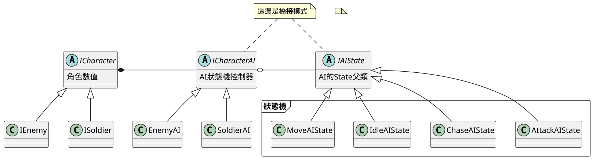
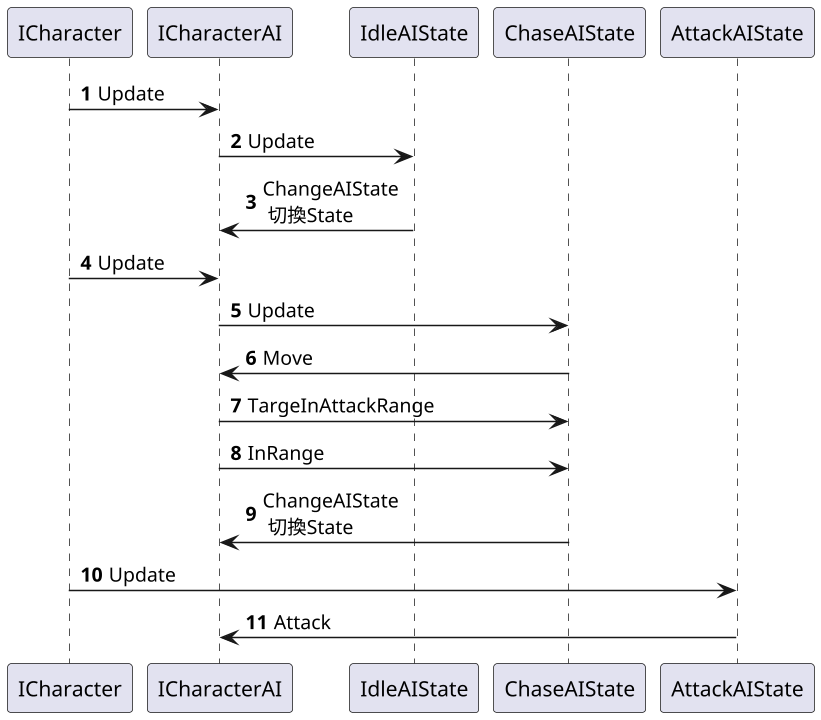

# 09.AI狀態模式 State

## 講解
- 基本上跟第一章狀態模式差不多
- AI狀態模式統稱狀態機

## 書中案例
- 書中案例來看，是將橋接模式應用在AI狀態機
- 在書中AI 涉及到 "閒置"、"追擊"、"攻擊"

## UML

## 時序圖

## 總結

實際上就提一下AI狀態機，但將控制器跟狀態分開，用橋接接起來，這部分很不錯
將狀態機跟狀態控制器分開，這樣分開，非常好維護，
即使有新人物，新增控制器，就可以簡單新增
既使企劃又要改，只要新增狀態，並且改一下更換的邏輯，就可以

PS:
這邊要注意，狀態機的切換規則要放在哪裡，
1. 放在 State 裡面的話，如果後期有不同規則，就必須修改到State
2. 放在控制器裡面，修改是比較方便，但控制器會一直修正