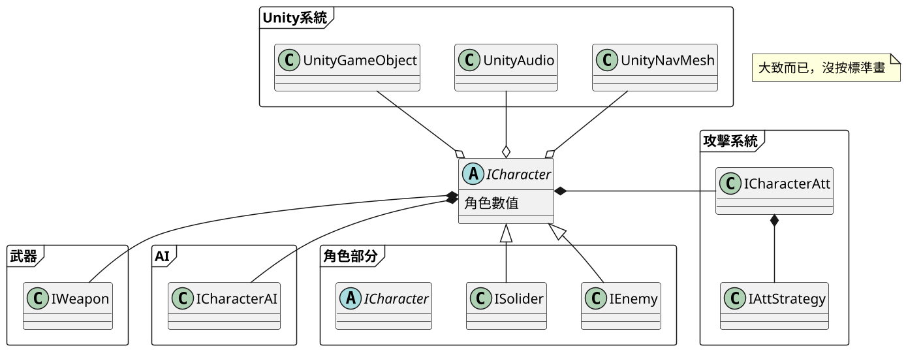
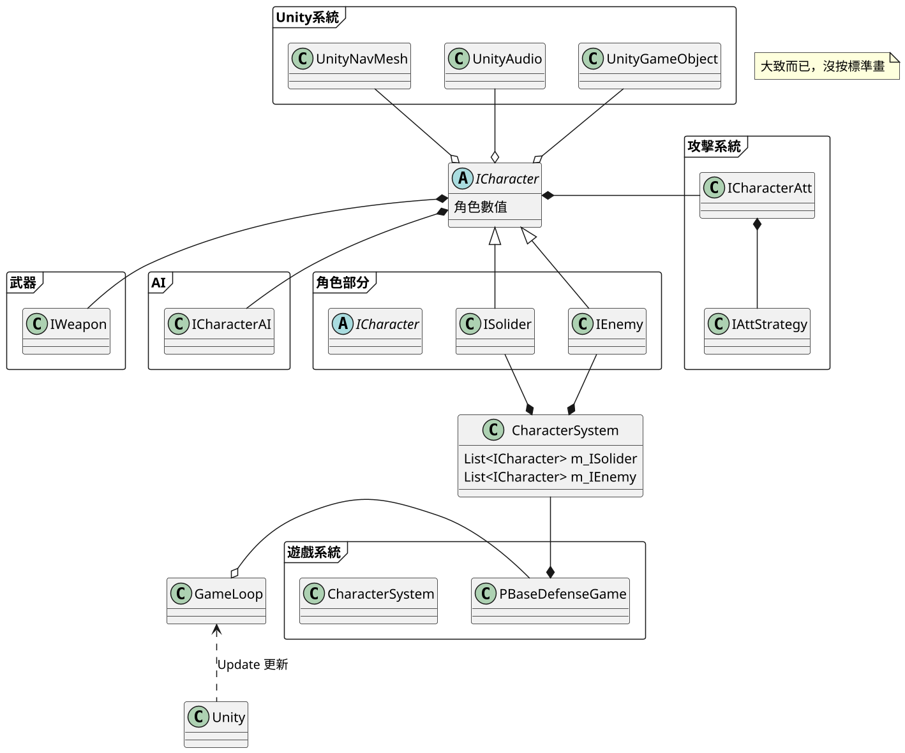
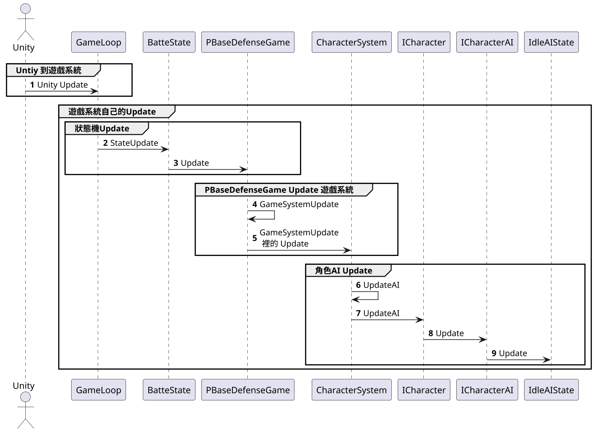

# 10.遊戲中角色系統

在書中前幾張介紹，角色系統畫出UML

```puml
@startuml
skinparam classAttributeIconSize 0
scale 1.5
package 攻擊系統 <<Frame>> {
  class ICharacterAtt
   class IAttStrategy
}

package Unity系統 <<Frame>> {
  class UnityGameObject
   class UnityAudio
    class UnityNavMesh
}

package 武器 <<Frame>> {
  class IWeapon
}

package AI <<Frame>> {
  class ICharacterAI
}

package 角色部分 <<Frame>> {
  class IEnemy
  class ISolider
  abstract class ICharacter
}

abstract class ICharacter{
角色數值
}

ICharacter <|-- IEnemy
ICharacter <|-- ISolider
ICharacter *-right- ICharacterAtt
ICharacter *-- IWeapon
ICharacter *-- ICharacterAI
ICharacterAtt *-- IAttStrategy

ICharacter o-up- UnityGameObject
ICharacter o-up- UnityAudio
ICharacter o-up- UnityNavMesh

note as N1
大致而已，沒按標準畫
end note

@enduml
```

但這只是角色而已，但角色需要用系統介入才能動
所以多個 CharacterSystem 介入來驅動角色
CharacterSystem只負責角色驅動以及角色AI驅動
CharacterSystem是繼承IGameSystem，
由PBaseDefenseGame來宣告並用Update驅動

```puml
@startuml
skinparam classAttributeIconSize 0
scale 1.5
package 攻擊系統 <<Frame>> {
  class ICharacterAtt
   class IAttStrategy
}

package Unity系統 <<Frame>> {
  class UnityGameObject
   class UnityAudio
    class UnityNavMesh
}

package 武器 <<Frame>> {
  class IWeapon
}

package AI <<Frame>> {
  class ICharacterAI
}

package 遊戲系統 <<Frame>> {
  class CharacterSystem
  class PBaseDefenseGame
}

package 角色部分 <<Frame>> {
  class IEnemy
  class ISolider
  abstract class ICharacter
}

abstract class ICharacter{
角色數值
}

class CharacterSystem{
List<ICharacter> m_ISolider
List<ICharacter> m_IEnemy
}

ICharacter <|-- IEnemy
ICharacter <|-- ISolider
ICharacter *-right- ICharacterAtt
ICharacter *-- IWeapon
ICharacter *-- ICharacterAI
ICharacterAtt *-- IAttStrategy

ICharacter o-up- UnityGameObject
ICharacter o-up- UnityAudio
ICharacter o-up- UnityNavMesh

CharacterSystem *-up- IEnemy
CharacterSystem *-up- ISolider

PBaseDefenseGame  *-up- CharacterSystem

GameLoop  o-right-  PBaseDefenseGame

Unity  .up.>  GameLoop :Update 更新

note as N1
大致而已，沒按標準畫
end note

@enduml
```

現在看看時序圖

```puml
@startuml
autonumber
scale 1.5

actor Unity
participant GameLoop
participant BatteState
participant PBaseDefenseGame
participant CharacterSystem
participant ICharacter
participant ICharacterAI
participant IdleAIState

group Untiy 到遊戲系統
Unity -> GameLoop :Unity Update
end

group 遊戲系統自己的Update

group 狀態機Update
GameLoop ->BatteState : StateUpdate

BatteState -> PBaseDefenseGame :Update
end

group PBaseDefenseGame Update 遊戲系統
PBaseDefenseGame -> PBaseDefenseGame : GameSystemUpdate

PBaseDefenseGame ->CharacterSystem : GameSystemUpdate \n 裡的 Update
end

group 角色AI Update
CharacterSystem -> CharacterSystem :UpdateAI

CharacterSystem -> ICharacter :UpdateAI

ICharacter -> ICharacterAI : Update

ICharacterAI -> IdleAIState :Update
end

end

@enduml
```