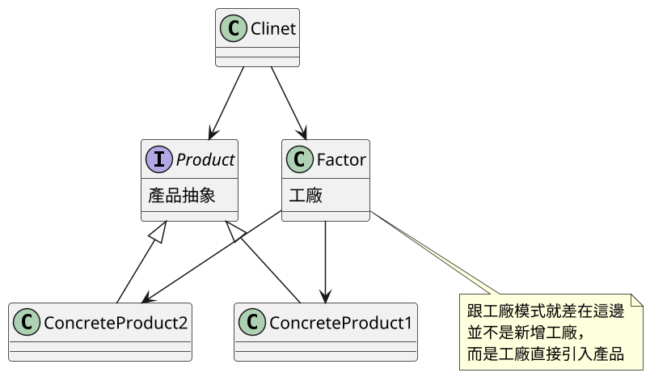
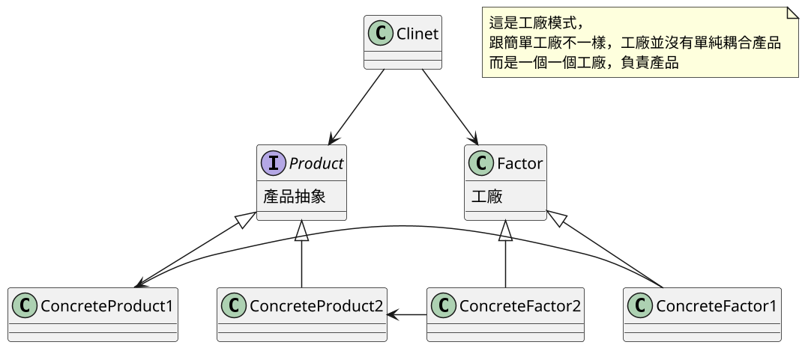
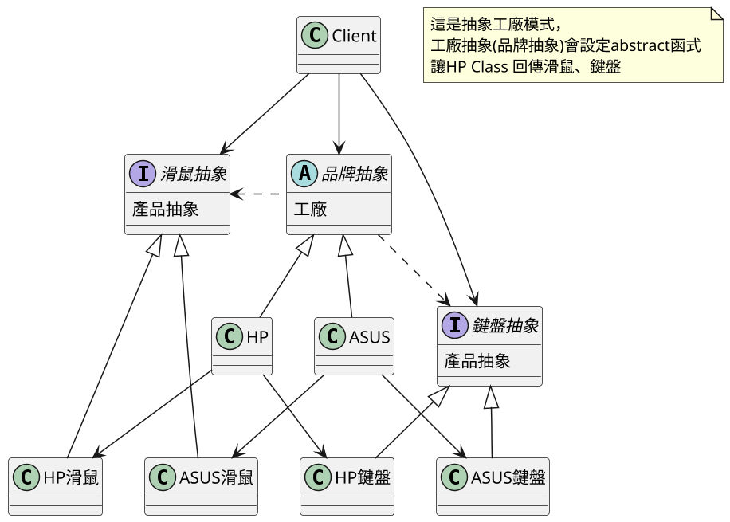

# 11.5題外話工廠模式分類

>參考 [设计模式-三种工厂模式  ](http://xuewei.world:8000/) 
>參考 [抽象工厂模式和工厂模式的区别？](https://www.zhihu.com/question/20367734)

## 講解
### 工廠模式:也就是將實例化分離並統一，已達成將實例化與程式解偶
如上一篇所講工廠模式分成
1. 簡單工廠
2. 工廠模式
3. 抽象工廠

這邊就講解下3個差異

### 簡單工廠

|                        |                                     |
| ---------------------- | ----------------------------------- |
| Factor 工廠             | 也就是工廠，在簡單工廠裡是直接引入產品 |
| Product抽像產品         | 負責產品實力後的統一接口              |
| ConcreteProduct實例產品 | 產品實例，再簡單工廠裡，就是被工廠引用 |



```JAVA
//工廠部分
interface Car{
    void run();
}
class Aodi implements Car{
    @Override
    public void run() {
        System.out.println("我是奥迪汽车...");
    }
}
class Benchi implements Car{
    @Override
    public void run() {
        System.out.println("我是奔驰汽车...");
    }
}
class CarFactory{
    static public Car createCar(String name) {
        Car car = null;
        if(name.equals("奥迪")) {
            car = new Aodi();
        }else if(name.equals("奔驰")) {
            car = new Benchi();
        }
        return car;
    }
}

//主程式部分
public class Main {
    public static void main(String[] args) {
        Car car = CarFactory.createCar("奔驰");
        car.run();
    }
}

```

就像程式碼打得一樣，由客戶端對工廠呼叫，工廠直接用產品實例回傳
#### 簡單工廠優缺點在於
- 優點 
    - 最簡單工廠實現
    - 工廠裡就包含所有實現方法，明確分割工作
- 缺點
    - 違反開閉原則 : 一旦要更改，必定更動到工廠 


### 工廠模式

|                        |                               |
| ---------------------- | ----------------------------- |
| Factor 抽像工廠         | 工廠抽象，提供工廠一個接口      |
| ConcreteFactor 實例工廠 | 實例工廠，工廠該返回什麼由他決定 |
| Product抽像產品         | 負責產品實力後的統一接口        |
| ConcreteProduct實例產品 | 產品實例，決定產品有什麼              |





```JAVA
//工廠端
public abstract class Car {
    public abstract void run();
}

public class Aodi extends Car {
    @Override
    public void run() {
        System.out.println("我是奥迪车..滴滴滴..");
    }
}

public class Benchi extends Car {
    @Override
    public void run() {
        System.out.println("我是奔驰车..滴滴滴..");
    }
}

public interface CarFactory {
    Car createCar();
}

public class AodiCarFactory implements CarFactory {
    @Override
    public Car createCar() {
        return new Aodi();
    }
}

public class BenchiCarFactory implements CarFactory {
    @Override
    public Car createCar() {
        return new Benchi();
    }
}


//客戶端
public class Client {
    public static void main(String[] args) {
        CarFactory carFactory1 = new AodiCarFactory();
        CarFactory carFactory2 = new BenchiCarFactory();
        Car car1 = carFactory1.createCar();
        Car car2 = carFactory2.createCar();
        car1.run();
        car2.run();
    }
}
```

就像程式碼打得一樣，由客戶端對工廠呼叫，工廠直接用產品實例回傳
但工廠產品是一對一，要調用不同工廠才能輸出對應實例

#### 工廠優缺點在於
- 優點 
    - 只需管理對應產品的工廠，設定好後就無需更動，符合開閉原則
- 缺點
    -  一旦要新增產品，就必須新增對應的工廠類，數量一多就很麻煩

### 抽象工廠

#### 定義 : 抽象工廠模式的實質是「提供介面，建立一系列相關或獨立的物件，而不指定這些物件的具體類。」

抽像工廠跟工廠(包含簡單工廠)，不太一樣，抽象工廠跟工廠層級不一樣
**抽象** 這兩字的意思是，把工廠這概念也抽象化，變成製作一組 
 **有關聯的產品簇(像電腦、螢幕、滑鼠，同為電腦產品概念)如圖**

用比喻的化
- 工廠 : 像是小工廠，一間工廠只做一項產品(例 : 小農工廠 一輩子只做農產品加工)
- 抽象工廠 : 像是品牌廠，旗下很多工廠，每間工廠做的產品都有關聯(例:ASUS 旗下有 桌機工廠、筆電工廠、螢幕工廠)


UML用品牌廠舉例

|                        |                               |
| ---------------------- | ----------------------------- |
| Factor 抽像工廠         | 工廠抽象，提供工廠一個接口      |
| ConcreteFactor 實例工廠 | 實例工廠，工廠該返回什麼由他決定 |
| Product抽像產品         | 負責產品實力後的統一接口        |
| ConcreteProduct實例產品 | 產品實例，決定產品有什麼        |



``` JAVA
//產品類
public interface Device {
    String getDeviceName();
}

public class RAM implements Device {
    private String factoryName;
    public RAM(String factoryName) {
        this.factoryName = factoryName;
    }
    @Override
    public String getDeviceName() {
        return "获得"+factoryName+"生产的RAM";
    }
}

public class CPU implements Device {
    private String factoryName;
    public CPU(String factoryName) {
        this.factoryName = factoryName;
    }
    @Override
    public String getDeviceName() {
        return "获得"+factoryName+"生产的CPU";
    }
}

public class Mouse implements Device {
    private String factoryName;
    public Mouse(String factoryName) {
        this.factoryName = factoryName;
    }
    @Override
    public String getDeviceName() {
        return "获得"+factoryName+"生产的Mouse";
    }
}

//工廠類

public interface DeviceFactory {
    Device createCPU();
    Device createARM();
    Device createMouse();
}

public class ChinaFactoy implements DeviceFactory {
    @Override
    public Device createCPU() {
        return new CPU("中国");
    }
    @Override
    public Device createARM() {
        return new RAM("中国");
    }
    @Override
    public Device createMouse() {
        return new Mouse("中国");
    }
}

public class JapanFactory implements DeviceFactory{
    @Override
    public Device createCPU() {
        return new CPU("日本");
    }
    @Override
    public Device createARM() {
        return new RAM("日本");
    }
    @Override
    public Device createMouse() {
        return new Mouse("日本");
    }
}

//客戶端

public class Client {
    public static void main(String[] args) {
        DeviceFactory factory = new JapanFactory();
        Device device = factory.createMouse();
        String string = device.getDeviceName();
        System.out.println(string);
    }
}


```

#### 抽象模式優缺點

- 優點 
    - 分離了產品系列的耦合，客戶端只需呼叫即可
    - 只要在初始化設定，就可以使用不同產品項目，能做到使用多系統 例:不同伺服器系統
- 缺點
    - 假如某個品牌沒有某項產品，就會導致程式出錯

## 總結

