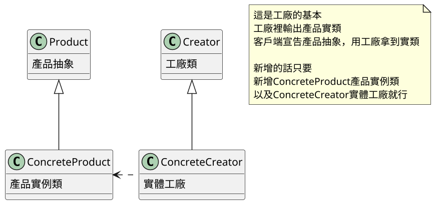
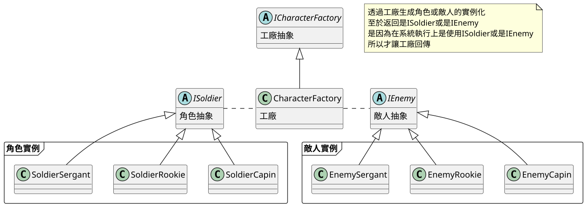
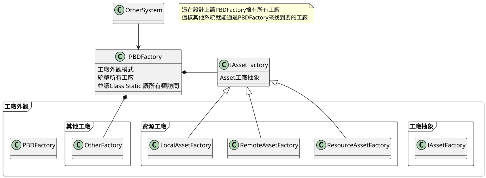

# 11.工廠模式 Factory Method

## 工廠理論講解
### 工廠模式是模式中很重要的一個
- 優點:無須一個個宣告，只要工廠實例化後，只要呼叫就能新增實例化出來，並且客戶端無須知道工廠內部如何運作，該如何實例化由工廠決定
- 工廠模式:也就是將實例化分離並統一，已達成將實例化與程式解偶
- 工廠模式有三種
    - 1. 簡單工廠
    - 2. 工廠
    - 3. 抽象工廠



### 書中提到工廠實現方法

#### 書中對於工廠實現方式有三種

##### 1. 普通工廠
就是單純的工廠，主程式呼叫，工廠回傳實例

```csharp
//工廠部分
	// 成品物件類型
	public abstract class Product
	{
	}
	
	// 成品物件類型A
	public class ConcreteProductA : Product
	{
		public ConcreteProductA()
		{
			Debug.Log("生成物件類型A");
		}
	}
	
	// 成品物件類型B
	public class ConcreteProductB : Product
	{
		public ConcreteProductB()
		{
			Debug.Log("生成物件類型B");
		}
	}
	
	// 宣告factory , 子類別會回傳對應的Product型別之物件
	public abstract class Creator
	{
		public abstract Product FactoryMethod();
	}

	// 產生ProductA的工廠
	public class ConcreteCreatorProductA : Creator
	{
		public ConcreteCreatorProductA()
		{
			Debug.Log("產生工廠:ConcreteCreatorProductA");
		}

		public override Product FactoryMethod()
		{
			return new ConcreteProductA();
		}
	}

	// 產生ProductB的工廠
	public class ConcreteCreatorProductB : Creator
	{
		public ConcreteCreatorProductB()
		{
			Debug.Log("產生工廠:ConcreteCreatorProductB");
		}
		public override Product FactoryMethod()
		{
			return new ConcreteProductB();
		}
	}
//工廠部分完

//主程式部分
        // 產品
		Product theProduct = null;

		// 工廠界面
		Creator theCreator = null;

		// 設定為負責ProduceA的工廠
		theCreator = new ConcreteCreatorProductA();
		theProduct = theCreator.FactoryMethod();

		// 設定為負責ProduceB的工廠
		theCreator = new ConcreteCreatorProductB();
		theProduct = theCreator.FactoryMethod();

```

##### 2. 參數工廠
在工廠生成中，添加Switch Case來判斷

```csharp
//工廠部分
	// 成品物件類型
	public abstract class Product
	{
	}
	
	// 成品物件類型A
	public class ConcreteProductA : Product
	{
		public ConcreteProductA()
		{
			Debug.Log("生成物件類型A");
		}
	}
	
	// 成品物件類型B
	public class ConcreteProductB : Product
	{
		public ConcreteProductB()
		{
			Debug.Log("生成物件類型B");
		}
	}

    // 宣告factory method，它會依參數Type的提示回傳對應Product類別物件
	public abstract class Creator_MethodType
	{
		public abstract Product FactoryMethod(int Type);
	}

	// 覆寫factory method，以回傳Product型別之物件
	public class ConcreteCreator_MethodType: Creator_MethodType
	{
		public ConcreteCreator_MethodType()
		{
			Debug.Log("產生工廠:ConcreteCreator_MethodType");
		}

		public override Product FactoryMethod(int Type)
		{
			switch( Type )
			{
			case 1: 
				return new ConcreteProductA();
			case 2:
				return new ConcreteProductB();			
			}
			Debug.Log("Type["+Type+"]無法產生物件");
			return null;
		}
	}
//工廠部分完

//主程式部分
        // 產品
		Product theProduct = null;

        // 工廠界面
		Creator_MethodType theCreatorMethodType = new ConcreteCreator_MethodType();

		// 取得兩個產品
		theProduct = theCreatorMethodType.FactoryMethod(1);
		theProduct = theCreatorMethodType.FactoryMethod(2);

```

##### 3.泛型工廠
泛型工廠是這三個工廠中最難理解，但卻是最好用的
因為泛型的特性只要輸入對的Class就能拿到對應的實例
泛型工廠還有分兩種
1. 泛型工廠
2. 泛型方法

###### 泛型工廠
就是讓工廠抽象設定泛型函式，然後讓實例工廠複寫泛型函式

```csharp
    //工廠部分
	// 成品物件類型
	public abstract class Product
	{
	}
	
	// 成品物件類型A
	public class ConcreteProductA : Product
	{
		public ConcreteProductA()
		{
			Debug.Log("生成物件類型A");
		}
	}
	
	// 成品物件類型B
	public class ConcreteProductB : Product
	{
		public ConcreteProductB()
		{
			Debug.Log("生成物件類型B");
		}
	}
	
    // 宣告factory method界箅,並使用Generic定義方法
	interface Creator_GenericMethod
	{
	//where T: Product, new();這句意思是，泛型輸入時需要是繼承Product的類
		Product FactoryMethod<T>() where T: Product, new();
	}

	// 覆寫factory method，以回傳Product型別之物件
	public class ConcreteCreator_GenericMethod : Creator_GenericMethod
	{
		public ConcreteCreator_GenericMethod()
		{
			Debug.Log("產生工廠:ConcreteCreator_GenericMethod");
		}

		public Product FactoryMethod<T>() where T: Product, new()
		{
			return new T();
		}
	}

//工廠部分完

//主程式部分
        // 產品
		Product theProduct = null;

      	// 使用Generic Method
		ConcreteCreator_GenericMethod theCreatorGM = new ConcreteCreator_GenericMethod();
		theProduct = theCreatorGM.FactoryMethod<ConcreteProductA>();
		theProduct = theCreatorGM.FactoryMethod<ConcreteProductB>();

```

###### 泛型方法
其實這個方法，已經算是單純用個方法實現他
直接用個方法弄好，然後呼叫他

```csharp
    //工廠部分
	// 成品物件類型
	public abstract class Product
	{
	}
	
	// 成品物件類型A
	public class ConcreteProductA : Product
	{
		public ConcreteProductA()
		{
			Debug.Log("生成物件類型A");
		}
	}
	
	// 成品物件類型B
	public class ConcreteProductB : Product
	{
		public ConcreteProductB()
		{
			Debug.Log("生成物件類型B");
		}
	}
	
// 宣告Generic factory類別
	public class Creator_GenericClass<T> where T : Product,new()
	{
		public Creator_GenericClass()
		{
			Debug.Log("產生工廠:Creator_GenericClass<"+typeof(T).ToString()+">");
		}

		public Product FactoryMethod()
		{
			return new T();
		}
	}

//工廠部分完

//主程式部分
        // 產品
		Product theProduct = null;

// 使用Generic Class
		// 負責ProduceA的工廠
		Creator_GenericClass<ConcreteProductA> Creator_ProductA = new Creator_GenericClass<ConcreteProductA>();
		theProduct = Creator_ProductA.FactoryMethod();

		// 負責ProduceA的工廠
		Creator_GenericClass<ConcreteProductB> Creator_ProductB = new Creator_GenericClass<ConcreteProductB>();
		theProduct = Creator_ProductB.FactoryMethod();

```

##### 小結

工廠方法很重要，因為只要有工廠方法，遊戲物件就能呼叫工廠拿到實例
而書中所教的三個工廠
普通工廠、參數工廠、泛型工廠

- 論方便性
泛型>參數>普通
泛型只要輸入就可以，
參數要額外設定參數，能用Enum來設定比較方便
普通的就要一個一個設定

- 論設計原則
    - 泛型 
        - 違反最少知識原則(其實我只是懷疑)
        - 因為讓客戶端必須知道要生成什麼Class的詳細具體
    - 參數
        - 違反 開閉原則(這很明顯)
        - 一旦工廠更改，就一定會動到Switch 
        - 但並不表示這是壞的選項，因為在少量物體下使用這種方法，能更快速建立工廠，以及呼叫
    - 普通
        - 違反........想不到

## 書中案例

### 在書中工廠模式

在書中工廠模式用來生成角色，使用Switch方式來確定角色，主要是在書中案例，
角色是固定 ，差異主要是在數值上，所以運用工廠去生成，從Unity讀取 "模型"、"材質"....
由工廠負責，客戶端就無須注意這些步驟



### 工廠模式遇到變化

在書中也有介紹工廠模式在遇到變化該麼辦
在書中提出的例子是Unity讀取資料
在Unity書中讀取資料有
1. Resouree資料夾讀取
2. 電腦本機 C://......
3. Web Sever
這三種，但根據不同裝置所要使用都不一樣
所已給出方法是，創建三種工廠來代表



## 總結

工廠模式在設計中運用的範圍特別多，
尤其是他返回實例，而實例是如何創建的這件事給關閉，客戶端無須知道
利用這特性，也就能做到像是分割Asset的輸入方式

在書中工廠模式運用在，Asset資源導入、武器生成、數值生成...上面
工廠模式還能與其他模式配合，例如:建造者模式