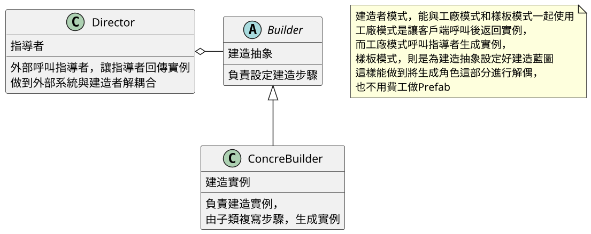
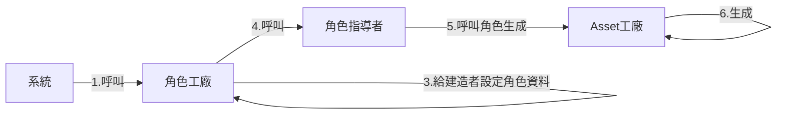
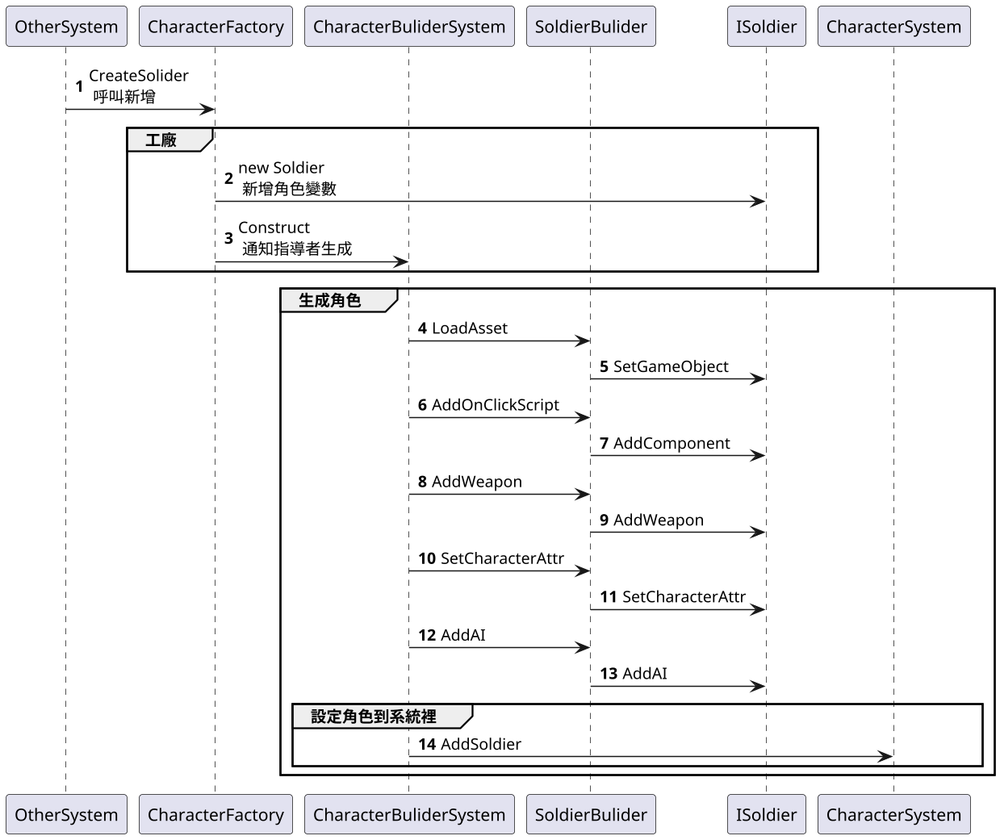

# 12.建造者模式 Builder

## 講解
- 建造者模式可以理解成**流水線**，就是所以實例要遵守一條流水線上所有步驟
- 透過建造者模式，可以維持一個物件生成的流程
- 優點
    - 很明顯，讓實例物件，遵循流水線，要增加會刪除，只需更改流水線上的配置

## 書中案例

書中案例建造者是用再生成角色步驟上 ，但書中隊建造者類改了下
新增個**角色資料類**，因為書中有多種角色組合，
所以讓工廠設定完**角色資料類**，在設定建造者類，在呼叫指導者生成

流程圖

時序圖

## 總結

建造者模式，主要適用於類似角色那樣
有一定步驟，且步驟相同，情況下建造者可以跟系統解耦
假如企劃要改，只要更動指揮者生成，再將建造者抽象更動
既使後面不用，只要把指揮者生成那段去掉即可
相對方便很多，雖然還是要改實類，但是不用翻天再找程式碼，哪裡再生成角色