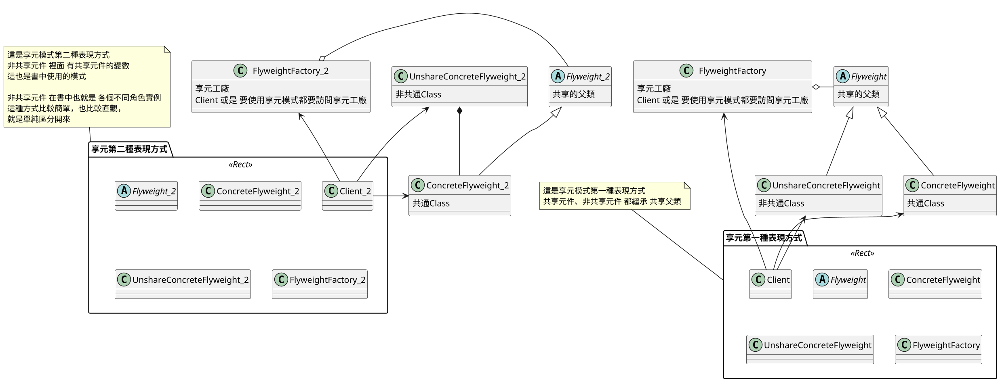
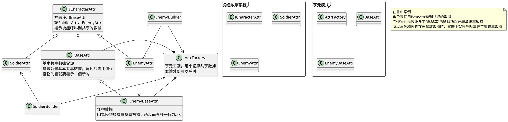
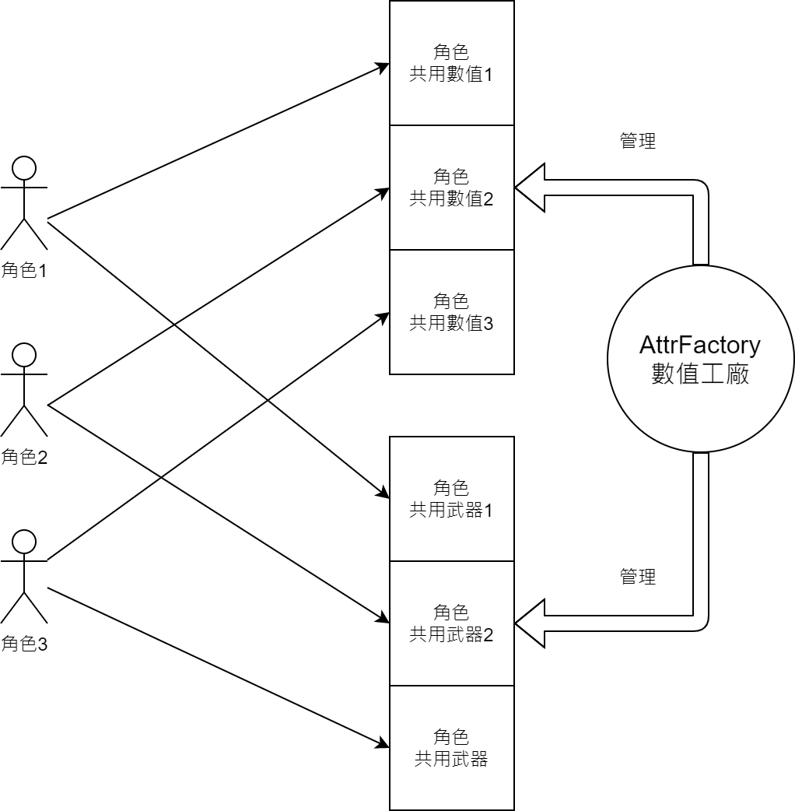
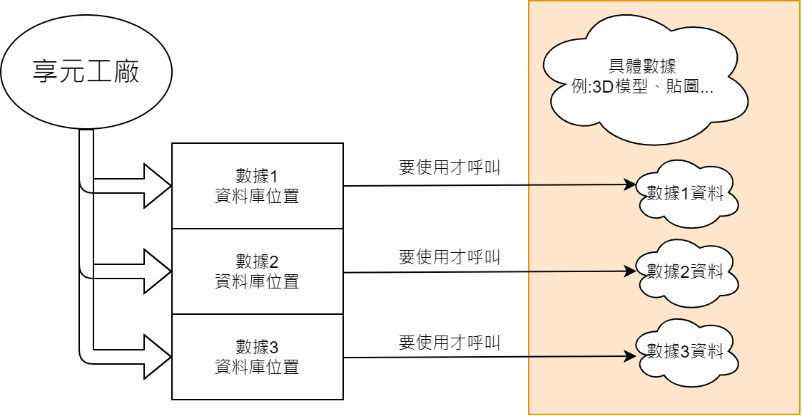

# 13.享元模式 Flyweight (我喜歡叫共享模式)

## 講解
- 享元模式也就是將**重複部分**，反覆利用來達到減低記憶體使用率
- 詳細也就是利用**雜湊表**或是**Dictionary**.....等 ，將Class存起來，外部呼叫就將其輸出出去

### UML

#### 享元模式在UML表現上有兩種表現方式

## 書中案例

書中案例是用於角色數據共用，
角色數據中，最大生命、移動速度、攻擊距離
這些是不會變的

### 書中UML

### 圖解化

## 總結

享元模式，在書中提及蠻多的，
最主要是因為享元模式，應用的好的話，能對遊戲的硬體需求下降些，
因為在遊戲中，對於數據一直生成，實際上是對遊戲楨數最大的傷害

### 書中案例注意事項
書中享元工廠會遇到下列兩個問題

1. 在書中享元工廠使用的數據，是寫死在程式碼裡的，這是因為書中案例個數很少，但若是遇到數量大就很麻煩  
#### 所以書中建議，享元工廠的數據要用外部讀取的方式

2. 數據量大的話，就會耗費大量時間讀取，這邊給出享元工廠只記錄**Key值**並非**數據**，這樣只要要用時再去尋找就好

