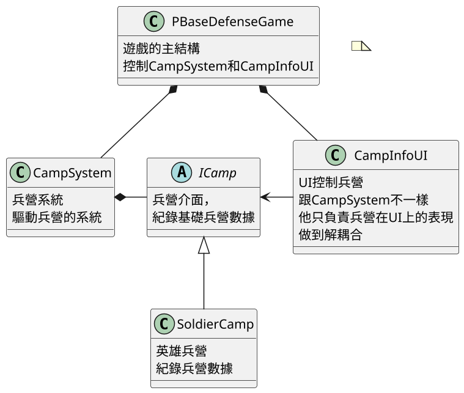
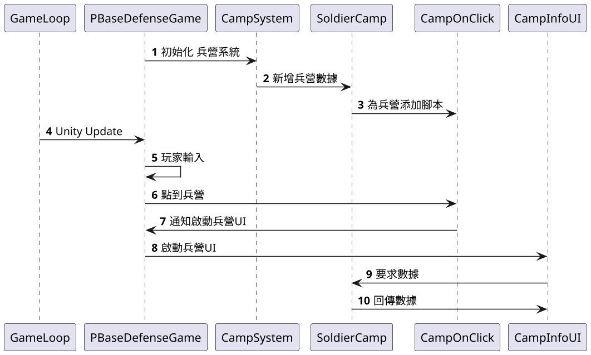

# 14.5遊戲中兵營實作

## 講解
在上一章講到UI的設計，這章講到遊戲中兵營的實作方式，包含在UI的顯示

首先是UML

UML好了後，就開始看流程

## 結論
跟去上面時序圖，我們可以知道上一節所講的UI內容的應用方式
利用PBaseDefenseGame作為外觀和中介者的方式，能讓遊戲開始時初始化兵營系統
當玩家輸入Input訊號時，利用PBaseDefenseGame中介者，呼叫UI系統做事，
這也是上一章說的，將UI和系統解耦合的方式