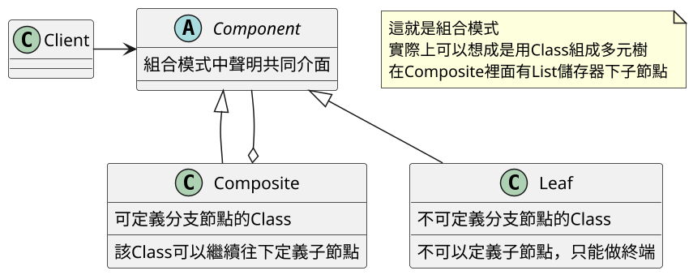
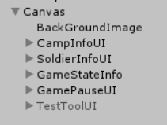
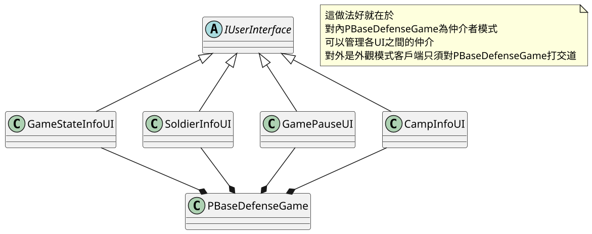
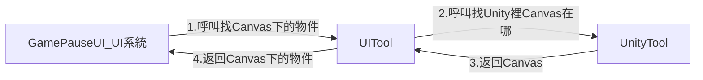

# 14.組合模式 Composite

## 前言
在書中案例中，並沒有使用組合模式在程式碼上，
而是用UGUI講解其概念與應用，
所以這篇筆記，在案例中也是講解在UGUI跟系統之間的關聯

## 講解
組合模式是應用在 **部分-整體(樹狀結構(階梯式結構))** 的層次結構下，組合模式可以使用戶對單個或是組合對象有一致性
講簡單點就是，可以讓Class形成樹狀結構(階梯式結構)

### UML

### 圖解

## 書中案例

在書中並無程式碼案例，是著重在UGUI設計上應用組合模式等方式，
並講解UI跟系統互動的方式
書中提到將UGUI用樹狀結構進行分類，例工廠UI一類，角色UI一類...之類的
最終就變成

將Canvas下進行分類，就可以將UI分類這樣的話
程式變得容易去寫
企劃容易更改
美術容易分類
最終在整合時只要區分成每大類，即可

書中UI都會繼承IUserInterface類，並與PBaseDefenseGame進行綁定

接下來結構好了，談實現部分
實現難在於，UGUI跟腳本之間的連接
在書中給出個方便的方法
1. 先用Find API找到Canvas
2. 再用找到的GameObject往下找個節點

這是書中對於UI跟系統間如何配合的作法，
對Canvas規定，之後只要名字不重複，基本上程式都能找到對應的UI
這作法，能將UGUI跟程式解耦合

## 總結

在書中提到的UI排版方法
- 優點
    - UI介面與實作分離，達到解耦合
    - 工作好切分，程式、美術、企劃 分離工作
    - 介面不會影響到專案，只要維持名稱，不太容易影響到程式運行
- 缺點
    - 元件名重複問題，元件名重複的話，在這案例中會有問題，因為案例是用搜尋的方式進行管理，重複的話就會出錯
    - 元件名更名問題，一樣在這案例，因為用搜尋的方式，所以名字改了就沒法找尋物件

