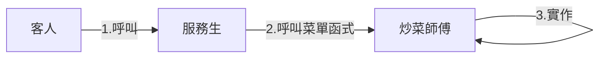
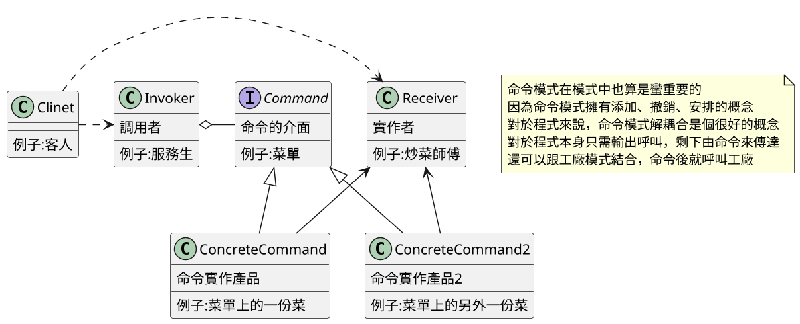
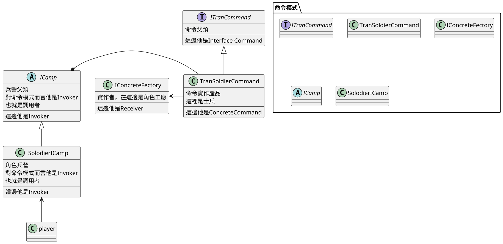
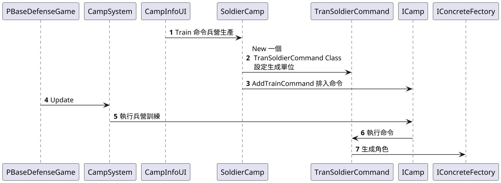

# 15.命令模式 Command

## 講解
命令模式可以構想成，客人跟服務生的關係，
客戶端只需要跟調用者呼叫，就可以去做任何事，
客戶端無須知道該如何實現，以達到解耦合

## 書中案例

在書中案例裡，是將命令模式應用在兵營命令上面，生產、撤銷生產

在書中案例有幾個比較特別的地方
1. 因為遊戲兵營是分開的所以能理解成一個兵營一個產品
2. 因第1點，所以命令模式中"實作產品"其實就是三個兵營
3. 角色兵營裡面設定了Invoker也就是調用者
4. 角色兵營會呼叫TranSoldierCommand去實作角色
5. TranSoldierCommand其實才應該為三種不同產品，但這案例將他挪到兵營上，所以才簡化成只是設定參數而已
6. 在這裡實作者為工廠

這案例算是命令的變種，將命令實作產品，挪到兵營裡，
而唯一實作的TranSoldierCommand也就是命令實作產品，變成設定數據版本，透過設定數據簡化成一個類，就不用做成三個類
兵營裡包含調用者，這就方便兵營的製作
實作者部分為工廠，這單純就是讓命令和工廠解耦合

這也跟遊戲機制設定有關，遊戲是兵營生兵所以才用設定數據，但數量多也會很麻煩

## 總結
命令模式很好用，在於它能將實作和執行區分開來，
在這案例實作由工廠決定，執行由命令決定，
但命令模式也要考慮一些東西
否則容易造成類別太多很難維護，或是有點繞太大圈子 例:書中案例的兵營升級就是直接調用函式製成