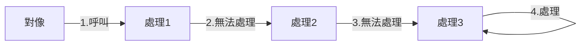
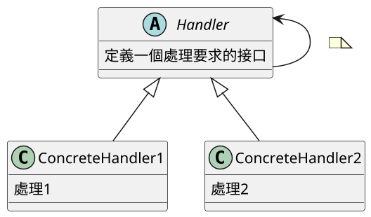
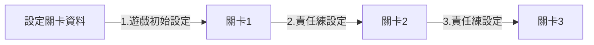
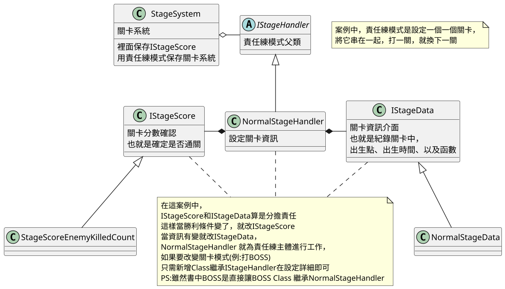

# 16.責任練模式 Responsibility (陸譯:职责链模式)

## 講解
責任練模式，用意在於多個對象的請求之間解耦合，
只須對一個對象請求，對象就會在一條練上持續要求，直到能找到回應請求的對象為止

## 書中案例

在書中責任練模式是應用在關卡系統，
因為書中關卡，實際上就是同一個場景，不同的怪物而已，
所以可以應用責任練模式，只要讀取預先設定好的關卡資訊即可

## 總結

責任練模式優點就在於，用Class來進行替換，這樣就不必寫一段段設定
在案例中用IStageScore和IStageData分擔責任
這樣也增加開放性，只要修改就可以新增更多關卡
當關卡進行變化時，就新增Class繼承NormalStageHandler(普通關卡)
改下IStageScore勝利條件，這樣就可以新增關卡，
還有，責任練模式不必從第一個練開始判斷，
在案例中，並不是第一個練，而是關卡結束就跳下一個，並不是從練的頭開始判斷

