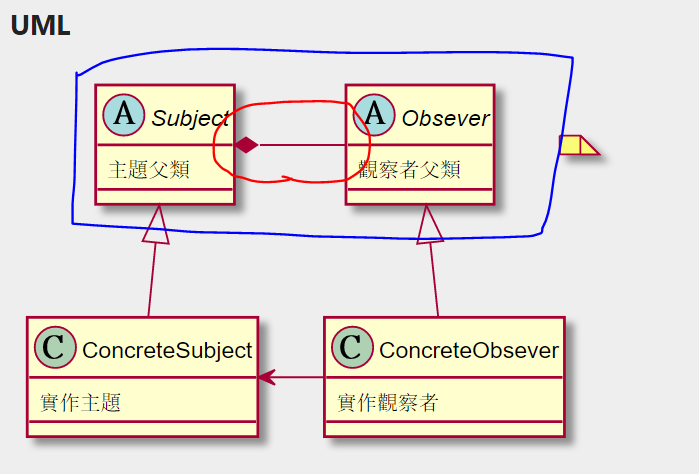

# 17.1觀察者模式 delegate用法

>除了delegate用法外還看到個不錯的方式看下方詳解
>[观察者设计模式 Vs 事件委托（java） ](https://blog.csdn.net/gdutxiaoxu/article/details/51824769)                 

在觀察者模式中，還是有個地方有過度依賴
也就是"主題父類"聚合"觀察者父類" 這部分有過度依賴



所以在大話設計模式中有改良方法，也就是使用delegate方式進行改進
透過delegate方式改進，不僅不需要"觀察者父類"，沒了他，就不需要"聚合(紅圈)"
所以可以用delegate改進"更新步驟"，
但這邊有個問題，因為少了"觀察者父類"無法用Class傳送變數，
所以可能要一個Class來拼接在下面例子就是Main函式

```Csharp
 class Program
    {
        static void Main(string[] args)
        {
            //老板胡汉三
            Boss huhansan = new Boss();

            //看股票的同事
            StockObserver tongshi1 = new StockObserver("魏关姹", huhansan);
            //看NBA的同事
            NBAObserver tongshi2 = new NBAObserver("易管查", huhansan);

            huhansan.Update += new EventHandler(tongshi1.CloseStockMarket);
            huhansan.Update += new EventHandler(tongshi2.CloseNBADirectSeeding);
           

            //老板回来
            huhansan.SubjectState = "我胡汉三回来了！";
            //发出通知
            huhansan.Notify();

            Console.Read();


        }
    }

    //通知者接口
    interface Subject
    {
        void Notify();
        string SubjectState
        {
            get;
            set;
        }
    }

    //事件处理程序的委托
    delegate void EventHandler();

    class Secretary : Subject
    {
        //声明一事件Update，类型为委托EventHandler
        public event EventHandler Update;

        private string action;

        public void Notify()
        {
            Update();
        }
        public string SubjectState
        {
            get { return action; }
            set { action = value; }
        }
    }

    class Boss : Subject
    {
        //声明一事件Update，类型为委托EventHandler
        public event EventHandler Update;

        private string action;

        public void Notify()
        {
            Update();
        }
        public string SubjectState
        {
            get { return action; }
            set { action = value; }
        }
    }

    //看股票的同事
    class StockObserver
    {
        private string name;
        private Subject sub;
        public StockObserver(string name, Subject sub)
        {
            this.name = name;
            this.sub = sub;
        }

        //关闭股票行情
        public void CloseStockMarket()
        {
            Console.WriteLine("{0} {1} 关闭股票行情，继续工作！", sub.SubjectState, name);
        }
    }

    //看NBA的同事
    class NBAObserver
    {
        private string name;
        private Subject sub;
        public NBAObserver(string name, Subject sub)
        {
            this.name = name;
            this.sub = sub;
        }

        //关闭NBA直播
        public void CloseNBADirectSeeding()
        {
            Console.WriteLine("{0} {1} 关闭NBA直播，继续工作！", sub.SubjectState, name);
        }
    }
```