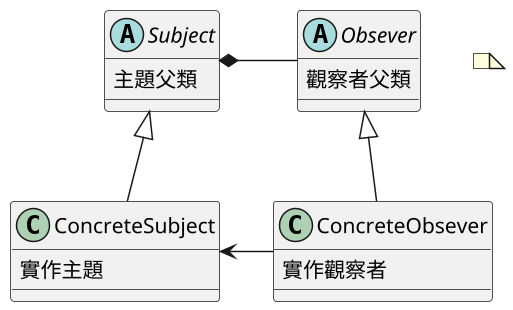
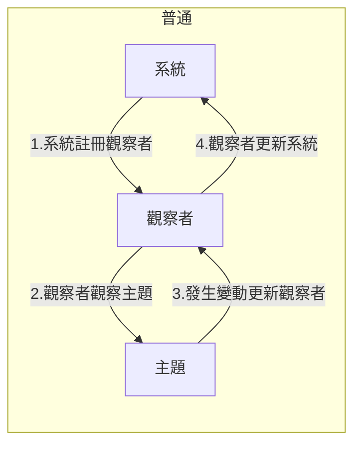
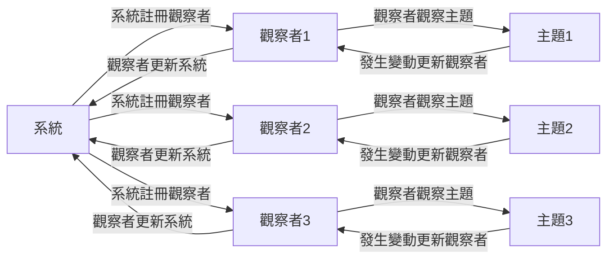
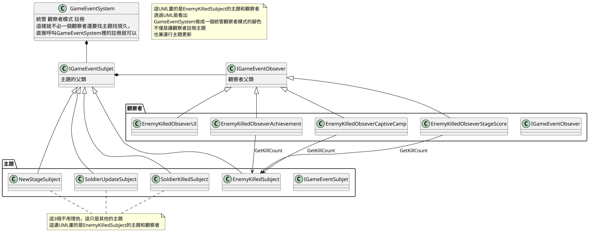
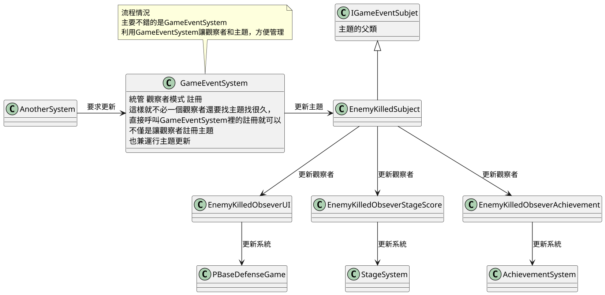
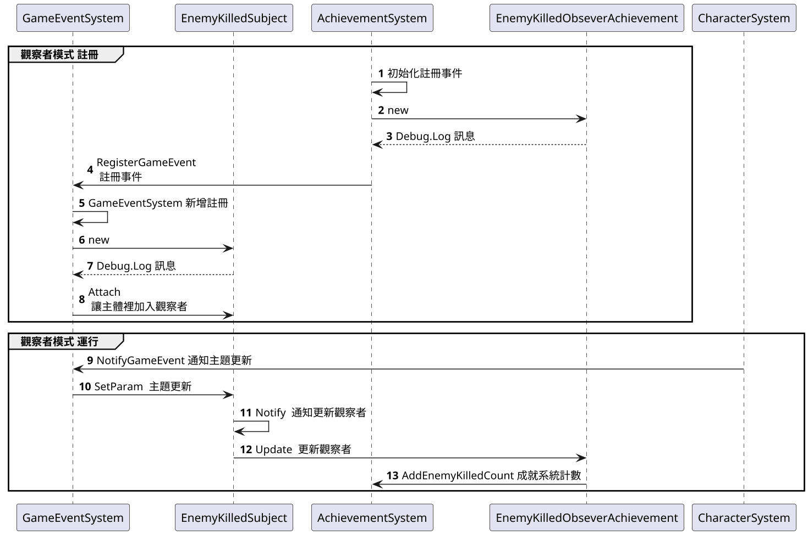

# 17.觀察者模式 Observer

## 講解
- 觀察者模式用簡單例子舉例，就是報社(主題)與訂戶(觀察者)之間的關係  
訂戶預定報紙，當有新報紙，通知所有訂戶

- 在觀察者數據分享有分為兩種
    - 推
        - 推也就是讓主題推送信息給觀察者
        - 優點 : 方便快速
        - 缺點 : 會變成，不用的數據也會推給觀察者
    - 拉
         - 跟推相反，讓觀察者去主題那裏拿訊息
         - 優點 : 數據會由觀察者自己拿取，無須管理
         - 缺點 : 主題需要有可供觀察者查詢的接口

### UML

## 書中案例

在書中提及的案例，是用觀察者製作成就系統，
讓系統設定觀察者，觀察者觀察主題，當主題變動後，觀察者更新系統
所以這案例中觀察者實際上類似中介
但就出現個嚴重問題，一但系統需要多個觀察，就必須新增許多觀察者
這樣會導致類別越來越多

### UML

### 流程

#### 詳細流程

## 結論

觀察者模式，應用在類似事件點上，
一般來說其他案例中觀察者，也是執行者，但是這樣容易讓觀察者工作太多，也就違反單一職責原則
所以這案例改成類似中介，但也就是導致類別越來越多
原因在於觀察者內部綁訂了系統(如下圖)
所以觀察者模式要好好考慮使用方法

