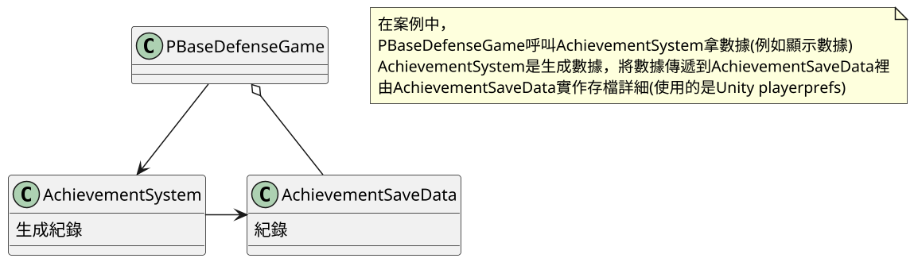

# 18.備忘錄模式 Memento

## 講解
看下圖，
其實流程那邊寫得有點短
但大致是沒錯，只要存檔、讀檔而已
至於紀錄保存，是否為多個紀錄，就由程式人員去設計

## 書中案例

在書中案例，備忘錄模式是用在幫成就系統存數據，
並且自案例中只存一筆資料，所以紀錄保存就沒用了，
所以案例中只有成就系統生成，以及成就系統資料
這邊存檔是使用Unity playerprefs

## 結論

備忘錄模式，適合用在存檔上面，包含生成Log檔之類的，只要跟存檔有關都行
在備忘錄模式中，如果有多個Originator就必須小心應對，免得存檔錯誤覆蓋，
若是要多格存檔只需對Caretaker進行製作就好，

