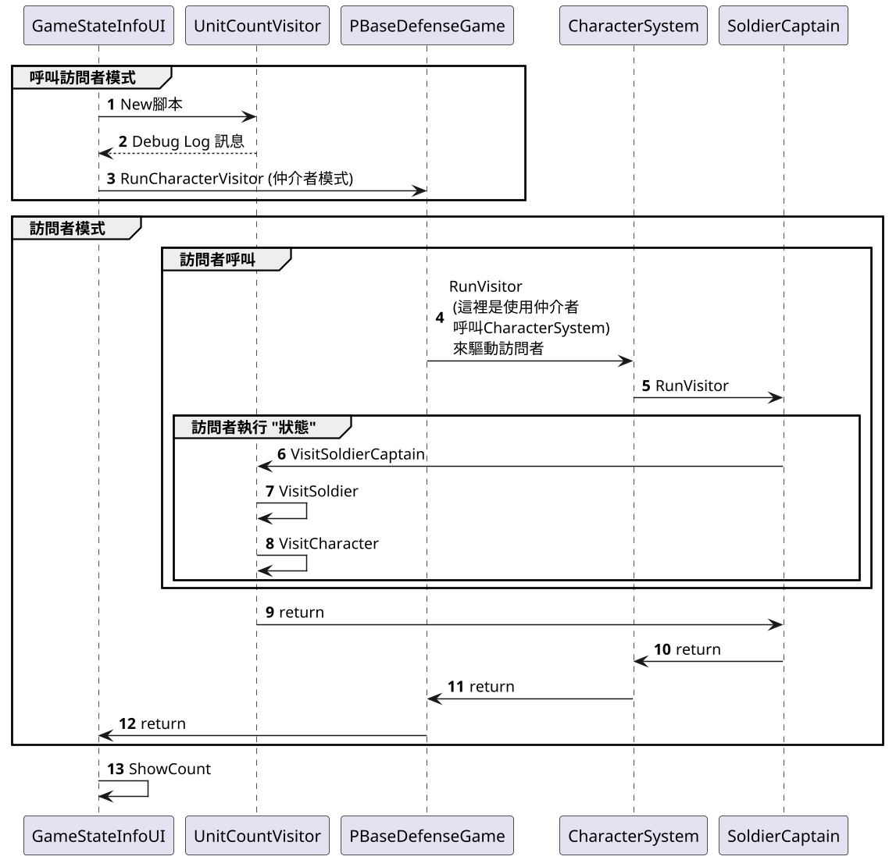

# 19.訪問者模式 Visitor

>詳見
>[ Day 25  每個人關心的點都不同 - 訪問者模式 (Visitor Pattern)
](https://ithelp.ithome.com.tw/articles/10208766)

## 講解

### 訪問者模式定義
- 訪問者模式( Visitor )，表示一個作用於某物件結構中的各元素之操作。它使你可以再不改變各元素之類別的前提之下，定義作用於這些元素的新操作。

訪問者模式，須注意
- 要在元素的個數是固定時(穩定的資料結構)
- 將處理和資料結構兩者分離開來。
- 增加操作就等於是增加新的Visitor。 

此模式最難用在於，
**要在元素的個數是固定時(穩定的資料結構)**
這點上，一旦元素變動，等於要將整個模式重寫

## 書中案例

書中案例是，有個系統，要負責統計角色數據，例:士兵有幾只，怪物有幾隻
所以要每個角色都要回報，就必須修改每個角色腳本，但這樣工程浩大，並且違反開閉原則
所以借助，訪問者模式，
原因簡單，因為所有角色都繼承ICharacter類，所以資料結構是穩定的(因為只有一個父類)，
只要用訪問者模式，分離了狀態和角色元素，只需對系統呼叫，就會返回腳色個數

## 結論

訪問者模式，在查到的資料中，都提到訪問者模式不好使用，
胡亂使用，容易導致後續新增資料不易，
並且訪問者容易讓Class封裝變差，因為要實現"狀態"要修改Class，所以使封裝變差

書中提到的訪問者可以跟觀察者合併使用
變成讓腳色訂閱觀察者，觀察者執行訪問者，
這樣能將訪問者得執行，變成訂閱方式，這樣比較容易進行改寫
