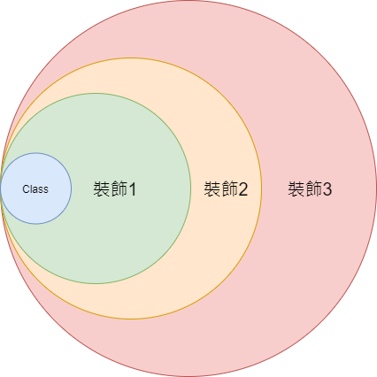

# 20. 裝飾模式 Decorator

## 講解
裝飾模式，可以理解成想是裝飾品一樣，可以套在某個類上，並隨時更換不同裝飾，
也就是讓裝飾模式，變成一種不會對現有模式有太大改變並且實現要製作功能的方式，
在執行上有點像責任練模式，因為會從外部裝飾類一路執行到Class

### UML

## 書中案例

在書中案例是將裝飾模式，用在已經製作完的角色系統上，
讓角色能在通過關卡後，獲得勳章來加成能力，
這時裝飾模式就起到作用，因為在無法更改主架構(角色系統)上
利用裝飾模式，讓角色的數值Class獲得裝飾，來以此變更數據

### UML

### 流程

## 結論

裝飾模式在書中提及的，主要用在
-  結構已經寫完，但要添加新功能時 例:案例中，加成數據 ，也就只是更換數據內容
-  需要常常更換演算方式 例:加密系統 ，利用更換裝飾方式，更換不同加密方式
-  具有複合性質的結構 例:特效  特效A+特效B=特效C   特效A+特效D=特效F 這樣，就可以透過更換裝飾的方式，來縮減時間 

裝飾模式，就是如此應用在，"更換"這上面，
但書中也提出，若是系統以後也會繼續使用情況下，最好一開始就寫進結構中
不然裝飾模式應用過多，可能會變成，過於跳躍，沒有一體性，會讓維護便難