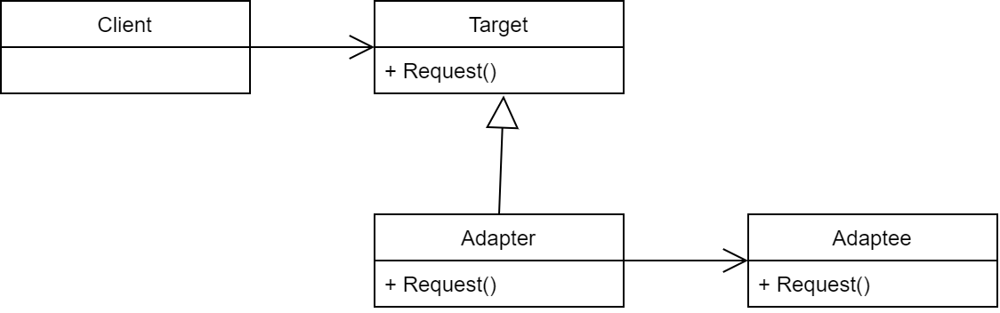

# 21.轉換器模式 Adapter (陸譯:适配器模式)

## 講解

轉接器模式很簡單，想成電源轉接頭就行

用程式來看，
- 轉接器模式就是讓兩個不同的Class進行連接，將其他Class轉換成可讀取方式
- 轉接器模式也有隔離作用，
    - 當 第三方函式庫 升級無法兼容時，只需更改轉接器就行，這樣不會讓程式本身過度耦合 第三方函式庫
    - 或是某功能有不同 函式庫，可以利用轉接器來選定

### 基本UML

## 書中案例

在書中案例裡，是玩家能生成敵兵來攻擊，
也就是"兵營"製作 "敵兵3D"、"敵兵數據"、"敵兵攻擊數據"、"我方AI"
這時就會遇到問題，若是弄個敵兵Class，東拼西湊，這就違反開閉原則
所以，解法是用轉接頭模式，將敵兵數據偽裝我方數據，然後合併到程式架構裡

## 結論

轉接器模式，在書中看來是個用作進行橋接等方式進行的，
書中特別說明，轉接器模式的隔離作用
將函式庫隔離開來，能避免過度耦合，

但要特別注意，轉接器模式在**大話設計模式**中提到，
轉接器模式是下下策，只有當Class都無法更改時，才拿出來，

