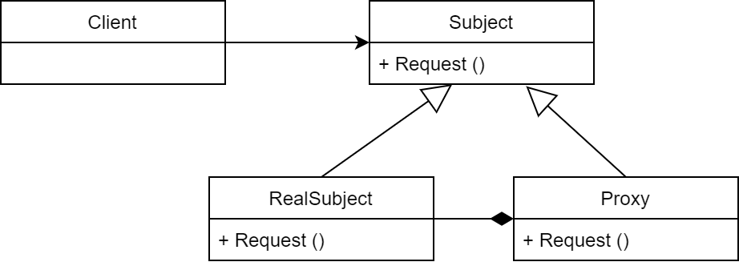

# 22. 代理模式 Proxy

## 講解

代理模式，為Class提供一個代理進行控制訪問
想成"經理(Class)"旁邊的"秘書(代理)"
代理能決定是否要運行Class得程式碼，為Class提供一個保護
就像"秘書(代理)"能決定"電話(訪問)"是否要交給"經理(Class)"

代理一共有
- 遠程代理
- 虛擬代理
- 保護代理
- 智慧型參考

### UML

## 書中案例

在案例中，是將代理模式運用在 AssetFactory 
讓外部呼叫 代理，當代理沒有該資源時，代理在呼叫AssetFactory
以此讓讀取資源的時間能降下來

在這邊代理模式作用看起來很像，享元模式
但只是使用上像，邏輯上不是
再加上Asset是需要再經過Unity實例化，跟享元不太一樣，
享元，是使用數值規劃，所以能讓其他參數直接參照

## 結論

這案例在代理中被稱作"保護代理"
代理的優點在於，能對代碼進行區分，
將是否要將加入原始類別的工作，交由代理實行，免去更改原文件
當不需要時，關閉代理Class就好

在書中案例，有提到案例太過小所以無法體會代理模式的強大，
所以代理不單單只有這些功能，
例如:在資源還未載入完時，用代理運行基本結構供玩家遊玩，當資源讀完後再恢復